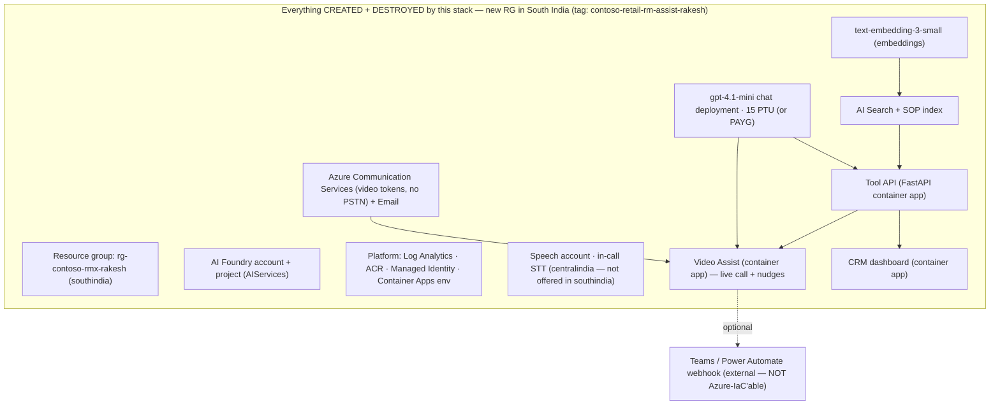

# Contoso Retail — RM Assist (Rakesh Sharma)

A lean, self-contained demo of an **AI copilot for a bank Relationship Manager (RM)**, focused on a
single end-to-end customer journey: the *Everyday RM Assist* flow for retail customer **Rakesh Sharma
(`CTB-RTL-002`)**, culminating in a **live, AI-coached video call**.

Everything is synthetic (data, personas, transcripts). The stack is **fully self-contained and
all-or-nothing**: it **creates its own resource group in South India and provisions everything inside
it** — the Azure AI Foundry account + project, the **`gpt-5.4` chat deployment** (a `GlobalStandard`
deployment used both for runtime intelligence and for **AI-generating the datasets + SOP corpus**),
the `text-embedding-3-small` embedding deployment, AI Search, ACS + Email, Speech, a **data-generation
+ Caddy/TLS VM**, and all the app infrastructure. It follows a **4-script model**: run
**`build_persistent.sh`** ONCE ever (a never-wiped static IP + reusable Let's Encrypt cert), then
**`build_rg.sh`** ONCE (the non-billable foundation), then **`build.sh`** per demo (the billable stack
— add `--regenerate-data` to force a full dataset + SOP rebuild on the VM with gpt-5.4); **`wipe.sh`**
fully purges the billable RG with **no soft-delete residue**, while preserving the persistent layer +
committed cert + committed data. Nothing is pre-provisioned or shared, so you can clone, deploy, demo,
and tear the whole thing down with a couple of commands.

> **All configuration lives in one file: [`infra/common/env.sh`](infra/common/env.sh).**
> It is pre-filled with the demo values. Nothing else hardcodes configuration — every script sources
> this file. To retarget the demo, edit only that file (or override any variable inline on the command line).

---

## What the demo shows

The RM (Priya Nair) works a portfolio in a CRM cockpit and is coached through a client conversation:

1. **Thesis** — why this customer matters now (declining balances, income volatility).
2. **Personas** — who Rakesh is, financially and behaviourally.
3. **Strategy** — the recommended play for the relationship.
4. **Offers** — concrete, compliant product offers grounded in policy (RAG over SOPs).
5. **Pre-call plan** — talking points and objection handling.
6. **Live video call (Step 7, the capstone)** — an ACS-based video call where an in-call engine posts a
   live **synopsis + nudges** to the RM (optionally into Microsoft Teams) as the conversation unfolds.
7. **Scheduling** — a customer-facing self-service page to book the follow-up.

The chat/synopsis/nudge intelligence is served by the **`gpt-5.4` (`GlobalStandard`)** deployment this stack creates.

---

## Architecture



---

## Foundation, data-gen VM & full-purge build/wipe (RM Assist pillars)

Beyond the single video-call demo, this repo now provisions the three foundational pillars of the
broader six-use-case **RM Assist** design for **Contoso Bank**:

**1. `gpt-5.4` Global Standard.** The chat deployment is `gpt-5.4` (`GlobalStandard`), created in the
billable RG by phase 2 and deleted by wipe. It powers both runtime intelligence and the AI generation
of the dataset + SOP corpus. The Foundry account lives in `AZ_REGION_AOAI` (defaults to `AZ_REGION`;
override if `gpt-5.4 GlobalStandard` isn't offered in your region — a build-time capability preflight
fails fast with guidance). Config: `infra/common/env.sh` §4.

**2. VM + Caddy + Let's Encrypt, minted once and committed.** A never-wiped **persistent RG**
(`build_persistent.sh`, run once ever) holds a **static public IP** that anchors the stable host
`rmassist.<ip>.nip.io`. A billable Ubuntu **VM** (phase 10) borrows that IP and runs **Caddy**, which
obtains a Let's Encrypt cert via HTTP-01 on the **first build only**; the cert store is then exported to
**`infra/cert/`** and committed. Every later build **pre-seeds the committed cert** so it is reused with
**no ACME call** (avoiding rate limits). The persistent RG + cert survive every wipe.

**3. Datasets + SOPs generated on the VM, auto-committed; full-purge wipe.** The dataset
(`data/contosobank/`) and SOP corpus (`docs/sop/contosobank_*.md`) are generated **on the VM** using the
VM's **managed identity** (keyless `gpt-5.4`) — deterministic Python owns all structural integrity
(IDs, FKs, amounts, ledgers), and **every narrative field** (notes, emails, complaints, meeting
summaries, covenant/collateral prose, SOPs) is AI-enriched. A `BASELINE_FROZEN` sentinel freezes the
result so future builds reuse it; **`build.sh --regenerate-data`** forces a full regenerate + re-freeze.
`build.sh` then **auto-commits + pushes** the data, SOPs and cert. `wipe.sh --delete-rg` performs a
**full purge**: it deletes the whole RG (VM included), purges soft-deleted Cognitive Services accounts
with retries, and **verifies no residue** — `tools/az-clean-slate.sh` is the belt-and-suspenders
purge+verify helper.

### The 4-script model

```bash
bash build_persistent.sh        # ONCE ever  — persistent RG + static IP + reusable cert anchor
bash build_rg.sh                # ONCE       — non-billable foundation (RG + platform)
bash build.sh                   # per demo   — billable stack; reuses committed data + cert
bash build.sh --regenerate-data # per demo   — force a full gpt-5.4 dataset + SOP rebuild on the VM
bash wipe.sh --delete-rg        # after demo — FULL PURGE of the billable RG (persistent layer kept)
```

Useful knobs: `SKIP_VMHOST=1` (skip the VM/cert/data-gen entirely), `SKIP_DATAGEN=1` (bring the VM up
but don't regenerate), `COMMIT_ARTIFACTS=0` (don't auto-commit/push), `LETSENCRYPT_STAGING=1` (mint from
the LE staging CA while testing). See `infra/common/env.sh` §5b for the persistent/VM/cert config.

---

## Operating this as a GitHub project

This repo is set up to run **from GitHub** — clone it into VS Code, deploy with a
button, and tear down with another. Start here:

- **[docs/CICD.md](docs/CICD.md)** — beginner-friendly CI/CD: VS Code + git setup,
  one-click **Deploy** / **Wipe** GitHub Actions (Azure **OIDC**, no stored
  passwords), or a self-hosted runner on your own VM.
- **[docs/ENTRA_PIM_ADMIN.md](docs/ENTRA_PIM_ADMIN.md)** — get a **temporary Global
  Admin** via Entra **PIM** and run `setup-graph.sh` to enable **real, calendared
  Teams meetings** on the RM's calendar (automated Microsoft Graph consent).
- **[docs/POWER_AUTOMATE.md](docs/POWER_AUTOMATE.md)** — configure the Power
  Automate flows for **Teams nudges** and **email / scheduling**.

Quick start (GitHub Actions):

```bash
gh repo clone hrshl-demo/contoso-retail-acs-rm-assist-videocall
cd contoso-retail-acs-rm-assist-videocall
bash scripts/setup-github-oidc.sh      # once: trust GitHub → Azure (needs az + gh login)
# then: GitHub ▸ Actions ▸ "Deploy to Azure" ▸ Run workflow ▸ ptu | payg
```

Secrets are **never committed**: copy `infra/common/secrets.env.example` →
`secrets.env` (git-ignored) for local runs, or set GitHub Actions secrets for CI
(see [docs/CICD.md](docs/CICD.md)).

---

## Prerequisites

- **Azure CLI** (`az`) logged in to the subscription in `env.sh` (`az login`). The Bicep CLI is
  installed on demand by `az`.
- **Docker** (container images for the Tool API, CRM dashboard, and Video Assist are built and pushed to ACR).
- **Bash** environment (Linux/macOS/WSL). The scripts are POSIX-bash and run non-interactively.
- Permissions to **create a resource group** and all resources within it, including creating/deleting
  an Azure AI Foundry (Cognitive Services) account and model deployments.
- **Quota:** a `GlobalProvisionedManaged` (PTU) chat deployment needs GlobalProvisionedManaged quota on
  the subscription (default build); `--type=payg` uses `GlobalStandard` quota instead. `gpt-4.1-mini`
  and `text-embedding-3-small` must be offered in `AZ_REGION` (default `southindia`) — change the region
  in `env.sh` if not.
- **Region-bound services move out of South India automatically.** AI Search and the standalone Speech
  (`SpeechServices`) account are **not** offered in `southindia`, so they default to `centralindia`
  (`AZ_REGION_SEARCH` / `AZ_REGION_SPEECH`, both overridable). They still land in the same resource group.
- **Nothing is pre-provisioned or reused.** The stack creates its own resource group and everything in it.

### The one external dependency

The only thing this stack **cannot** create or destroy in Azure is the **Teams / Power Automate nudge
webhook** (a Power Platform "When a Teams webhook request is received" trigger). It is a signed, stable
URL, pre-filled in `env.sh` (`TEAMS_WEBHOOK_URL`). Leave it empty to run the demo without Teams posting —
**the video call still works; nudges just won't appear in Teams.**

---

## Deploy

There are two ways to build: a **one-shot** wrapper, and a **3-script split** that is friendlier to
locked-down subscriptions (it does the one-time, RG-level setup separately from the billable stack).

### Option A — one-shot (`deploy.sh`)

```bash
bash deploy.sh                 # DEFAULT: create a 15-PTU gpt-4.1-mini chat deployment
bash deploy.sh --type=payg     # instead create a pay-as-you-go (GlobalStandard) chat deployment
```

Creates the resource group **and** everything inside it in a single run.

### Option B — 3-script split (`build_rg.sh` → `build.sh` → `wipe.sh`)

Use this when you want the RG-level, non-billable setup applied **once** and reused across many
demo cycles (so each demo is just the fast, billable app build + teardown):

```bash
bash build_rg.sh              # run ONCE — creates RG + platform (non-billable)
bash build.sh                 # per demo — billable stack (PTU).  build.sh --type=payg for PAYG
# ... run your demo ...
bash wipe.sh                  # after a demo — deletes the billable stack, KEEPS the RG + platform
bash build.sh                 # next demo — no need to re-run build_rg.sh
```

| Script | When | Creates / deletes | Billable? |
|--------|------|-------------------|-----------|
| `build_rg.sh` | once | Resource group + Log Analytics, ACR, UAMI, Container Apps env | No (ACR Basic ~$5/mo is the only standing cost) |
| `build.sh [--type=…]` | per demo | AI Foundry account + project, chat + embedding deployments, AI Search, ACS + Email, Speech, Tool API, RAG index, CRM dashboard, Video Assist | **Yes** |
| `wipe.sh` | after a demo | Deletes everything `build.sh` created; **keeps** the RG + platform | stops billing |

`deploy.sh` is exactly `build_rg.sh` + `build.sh` in one process (`BUILD_STAGE=all`); `build_rg.sh`
runs `BUILD_STAGE=foundation` and `build.sh` runs `BUILD_STAGE=apps`. All three share the same phase
scripts and `env.sh`, so behavior is identical — only *how much* runs per invocation differs.

### Chat-model modes (`--type`)

| `--type` | Chat deployment created | SKU | Deleted by `wipe.sh`? |
|----------|-------------------------|-----|-----------------------|
| *(none)* / `ptu` **(default)** | `gpt-4.1-mini-ptu` | `GlobalProvisionedManaged`, **15 PTU** | ✅ yes |
| `payg` | `gpt-4.1-mini-payg` | `GlobalStandard`, pay-as-you-go | ✅ yes |

- **Both modes CREATE the chat deployment** and **delete it on wipe**. The only difference is the SKU:
  PTU reserves 15 provisioned units (billed hourly while it exists); PAYG bills per token used.
- `wipe.sh` deletes the deployment **regardless of the `--type` you pass to it** (or don't): the
  Phase-2 teardown enumerates and removes *every* model deployment on the Foundry account — chat
  (`-ptu` **and** `-payg`) plus the embedding — so a PAYG stack is fully torn down even by a bare
  `bash wipe.sh`. (Names listed in `AOAI_CHAT_PROTECTED_DEPLOYMENTS`, empty by default, are skipped.)
- Everything is driven by env vars in `infra/common/env.sh` (see the DEPLOY_TYPE table below) — no
  values are hardcoded in the scripts.

The build runs `infra/rebuild-parallel.sh`, which builds in dependency-ordered waves:

| Wave | Phase(s) | Stage | What it does |
|------|----------|-------|--------------|
| 0 | `phase0-foundation` | foundation | **Create the resource group** + register resource providers |
| 1 | `phase1-platform` | foundation | Log Analytics, ACR, managed identity, Container Apps env |
| 2 | `phase2-ai` ∥ `phase3-data` | apps | **Create the AI Foundry account + project**, then the `gpt-4.1-mini` chat deployment (PTU or PAYG) **and** the `text-embedding-3-small` embedding deployment, AI Search, ACS + Email, Speech, role grants · validate synthetic data |
| 3 | `phase4-toolapi` | apps | FastAPI Tool API container app (reads phase2 config from `outputs.env`) |
| 4 | `phase5-rag` ∥ `phase9-videoassist` | apps | Index SOPs into AI Search · deploy the Video Assist live-call app |
| 5 | `phase6-crm` | apps | CRM dashboard (injects the Video Assist URL into Step 7) |

On success the build prints the CRM dashboard URL, the Video Assist URL, the Step 7 launch link
(`…/?customer_id=CTB-RTL-002`), and a health check.

> **Cost note:** a `GlobalProvisionedManaged` (PTU) deployment bills **per hour while it exists**,
> whether or not you send traffic. `--type=payg` bills per token instead. Either way, run
> `bash wipe.sh` when you're done — it deletes the billable stack, so **all** model/Search/ACS billing
> stops (only the ~$5/mo ACR remains if you keep the foundation for the next demo).

### Key Vault-free by design

This stack uses **no Azure Key Vault**. Every application secret (the Tool API bearer token, the
Foundry/Search/ACS endpoints and connection strings) is passed straight into the Container Apps as
**literal secret values** — set as `@secure()` Bicep parameters or `az containerapp secret set`, and
carried between phases via each phase's `outputs.env` file. The base container image for the CRM
frontend is cached with an authenticated `az acr import` (inline Docker Hub credentials), not a
KV-backed ACR credential set.

The practical upshot: the build is **immune to subscription Azure Policies that lock down Key Vault
public access** (`publicNetworkAccess=Disabled` / `ForbiddenByConnection`). There is nothing to heal,
exempt, or allow-list — the deployer never touches a vault data plane.

## Tear down

```bash
bash wipe.sh                 # DEFAULT: delete the billable stack, KEEP the RG + platform
bash wipe.sh --delete-rg     # FULL: delete the ENTIRE resource group + purge soft-deleted names
```

By **default** `wipe.sh` performs a **per-phase teardown that keeps the resource group and the Phase-1
platform** (Log Analytics, ACR, UAMI, Container Apps env). It deletes the AI Foundry account
+ project, both model deployments, AI Search, ACS + Email, Speech and the container apps — everything
`build.sh` created — and purges the soft-deleted Cognitive Services accounts so their names free up for
the next `build.sh`. This is the fast demo loop: `build_rg.sh` once, then `build.sh` / `wipe.sh` /
`build.sh` / … without re-creating the foundation.

Pass **`--delete-rg`** (or `WIPE_DELETE_RG=1`) for the full **all-or-nothing** teardown: `az group
delete` removes the entire resource group — foundation included — then the soft-deleted AIServices +
Speech accounts are purged so every globally-unique name is immediately reusable.

Safety & useful overrides:

- The wipe **refuses to delete a resource group that isn't tagged** `project=contoso-retail-rm-assist-rakesh`
  (protects you if `AZ_RG` is ever pointed at a shared RG). Override with `WIPE_FORCE=1 bash wipe.sh --delete-rg`.
- `KEEP_PLATFORM=0 bash wipe.sh` — also tear down the Phase-1 platform (but still keep the empty RG).
- `WIPE_RG_NOWAIT=1 bash wipe.sh --delete-rg` — submit the RG delete asynchronously and return immediately
  (skips the soft-delete purges, since the delete hasn't finished yet).
- `WIPE_PURGE_SOFT_DELETED=0 bash wipe.sh --delete-rg` — skip purging soft-deleted CogSvc accounts.

---

## Speed / performance (deploy & wipe are faster by default)

Deploy and wipe each used to take ~30 min. These optimizations are **on by default** and each has a
safe fallback (set the env var to disable and you get the old behavior exactly):

| Tunable | Default | What it does |
|---------|---------|--------------|
| `PREBUILD_IMAGES` | `1` | Builds the three container images (Tool API, Video Assist, CRM dashboard) **concurrently in the background** right after phase1, so they finish *while* phase2 provisions AI Search (the ~10-min long pole). Phases 4/6/9 then reuse the ready images instead of building serially across later waves. If any pre-build fails, that phase falls back to building inline. Set `0` to build inline as before. |
| `PHASE5_REBUILD_TOOLAPI` | `0` | Skips phase5's Tool API image rebuild — phase4's image already contains `rag.py`/`search.py` and RAG is read from AI Search at runtime, so no redeploy is needed just to "enable RAG". Set `1` to force a rebuild+redeploy (e.g. if you changed backend code between phase4 and phase5). |
| `WIPE_PARALLEL_DELETES` | `1` | Tears down independent resources **concurrently**: phase1's ~15-min Container Apps Environment delete overlaps the KV/ACR/Log-Analytics/UAMI deletes, and phase2 deletes AI Search in parallel with ACS/Email. All tag assertions still run up-front *before* any delete, so teardown safety is unchanged. Set `0` for sequential deletes. |

Net effect: deploy ≈ **18–20 min** (was ~30) by overlapping ~10–12 min of image builds under phase2 and
dropping the redundant phase5 rebuild; wipe is meaningfully faster via the parallel phase1 teardown.
For the fastest demo loop, run `bash build_rg.sh` **once**, then cycle `bash build.sh` / `bash wipe.sh`
(the default `wipe.sh` keeps the RG + platform, so each `build.sh` skips the foundation entirely).

---

## Configuration reference (`infra/common/env.sh`)

Every variable is listed below with its pre-filled demo value. Override any of them inline, e.g.
`AZ_REGION=westus2 bash deploy.sh`.

### 1) Core Azure context (RG is CREATED + DELETED by this stack)
| Variable | Default | Notes |
|----------|---------|-------|
| `AZ_SUBSCRIPTION_ID` / `AZURE_SUBSCRIPTION_ID` | *(pre-filled)* | Target subscription |
| `AZ_TENANT_ID` | *(pre-filled)* | Entra tenant |
| `AZ_RG` | `rg-contoso-rmx-rakesh` | Resource group — **created** by phase0, **deleted** on wipe |
| `AZ_REGION` / `AZURE_LOCATION` | `southindia` | Primary region (everything lands here) |
| `AZ_REGION_SEARCH` | `centralindia` | AI Search region (override independently for capacity) |
| `AZ_REGION_SPEECH` | `centralindia` | Speech account region — **South India does not offer the standalone `SpeechServices` kind**, so it defaults to a nearby Speech-capable region |

### 2) AI Foundry (AIServices) account + project — CREATED + DELETED by this stack
| Variable | Default | Notes |
|----------|---------|-------|
| `NAME_AISERVICES` | `aifndry-rmx-${SUFFIX}` | AIServices account (also its custom subdomain — globally unique) |
| `NAME_FOUNDRY_PROJECT` | `proj-rmx-${SUFFIX}` | Foundry project (child of the account) |
| `EXISTING_AISERVICES_NAME` | `= NAME_AISERVICES` | Back-compat alias the apps reference |
| `EXISTING_FOUNDRY_PROJECT_NAME` | `= NAME_FOUNDRY_PROJECT` | Back-compat alias |
| `AZURE_EXISTING_RESOURCE_ID` / `…AIPROJECT_RESOURCE_ID` / `…AIPROJECT_ENDPOINT` | derived | Built from the names above |

### 3) Project identity (isolates this stack for safe teardown)
| Variable | Default | Notes |
|----------|---------|-------|
| `PROJECT_TAG_KEY` | `project` | Tag key |
| `PROJECT_TAG_VALUE` | `contoso-retail-rm-assist-rakesh` | Teardown guard keys off this |
| `PROJECT_TAG` | `project=contoso-retail-rm-assist-rakesh` | Combined |
| `SUFFIX` | sha256-derived (5 chars) | Makes globally-unique names |

### 4) Chat + embedding models — selected by `DEPLOY_TYPE` (`--type=ptu` default, or `--type=payg`)

`DEPLOY_TYPE` (exported by `deploy.sh`/`wipe.sh` from `--type=`; default `ptu`) picks one of two
profiles. In **both** profiles the chat deployment is CREATED in the new RG and DELETED with it on wipe;
only the SKU/name/capacity differ. The embedding deployment is always created too.

| Variable | Default | Notes |
|----------|---------|-------|
| `DEPLOY_TYPE` | `ptu` | `ptu` = create a 15-PTU deployment · `payg` = create a GlobalStandard pay-as-you-go one |
| `AOAI_CHAT_MODEL_NAME` | `gpt-4.1-mini` | Chat model (both profiles) |
| `AOAI_CHAT_MODEL_FORMAT` | `OpenAI` | |
| `AOAI_CHAT_MODEL_VERSION` | *(empty)* | Empty ⇒ auto-discover latest version in the region |
| `AOAI_CHAT_PAYG_DEPLOYMENT_NAME` | `gpt-4.1-mini-payg` | **PAYG profile:** deployment name to create |
| `AOAI_CHAT_PAYG_SKU_NAME` | `GlobalStandard` | PAYG SKU |
| `AOAI_CHAT_PAYG_SKU_CAPACITY` | `50` | PAYG capacity (×1K TPM quota units) |
| `AOAI_CHAT_PTU_DEPLOYMENT_NAME` | `gpt-4.1-mini-ptu` | **PTU profile:** deployment name to create |
| `AOAI_CHAT_PTU_SKU_NAME` | `GlobalProvisionedManaged` | PTU SKU |
| `AOAI_CHAT_PTU_SKU_CAPACITY` | `15` | **15 PTU** |
| `AOAI_CHAT_DEPLOYMENT_NAME` / `AOAI_CHAT_SKU_NAME` / `AOAI_CHAT_SKU_CAPACITY` | *(resolved)* | Active values from the selected profile |
| `AOAI_CHAT_MANAGE_LIFECYCLE` | `1` | Always create + delete (both profiles) |
| `AOAI_CHAT_PROTECTED_DEPLOYMENTS` | *(empty)* | Space-separated names `wipe` will never delete (unused here — whole RG is deleted) |
| `EXISTING_AOAI_CHAT_DEPLOYMENT` | `= AOAI_CHAT_DEPLOYMENT_NAME` | What the apps reference |
| `AOAI_EMBED_MODEL_NAME` | `text-embedding-3-small` | Embedding model (created) |
| `AOAI_EMBED_MODEL_FORMAT` | `OpenAI` | |
| `AOAI_EMBED_MODEL_VERSION` | *(empty)* | Empty ⇒ auto-discover latest |
| `AOAI_EMBED_DEPLOYMENT_NAME` | `text-embedding-3-small` | Embedding deployment name (created) |
| `AOAI_EMBED_SKU_NAME` | `GlobalStandard` | `text-embedding-3-small` is offered as `GlobalStandard` (not plain `Standard`) in `southindia` |
| `AOAI_EMBED_SKU_CAPACITY` | `50` | ×1K TPM quota units |
| `EXISTING_AOAI_EMBED_DEPLOYMENT` | `= AOAI_EMBED_DEPLOYMENT_NAME` | What the RAG indexer references |

### 5) Net-new resource names (created + deleted)
| Variable | Default |
|----------|---------|
| `NAME_LAW` | `log-rmx` |
| `NAME_ACR` | `acrrmx${SUFFIX}` |
| `NAME_UAMI` | `id-rmx-app` |
| `NAME_ACA_ENV` | `cae-rmx` |
| `NAME_SEARCH` | `srch-rmx-${SUFFIX}` |
| `NAME_ACS` | `acs-rmx-${SUFFIX}` |
| `NAME_SPEECH` | `spch-rmx-${SUFFIX}` |
| `NAME_CA_TOOLAPI` | `ca-rmx-toolapi` |
| `NAME_CA_CRM` | `ca-rmx-dashboard` |
| `NAME_CA_VIDEOASSIST` | `videoassist-web` |
| `NAME_ACS_VIDEO` | `acs-rmx-video-${SUFFIX}` |
| `SEARCH_INDEX_NAME` | `contoso-retail-policy-index` |

### 6) Video Assist — AI + Speech + ACS (derived; Entra auth, no keys)
| Variable | Default |
|----------|---------|
| `AZURE_AI_ENDPOINT` | `https://${EXISTING_AISERVICES_NAME}.services.ai.azure.com/openai/v1` |
| `AZURE_AI_CHAT_DEPLOYMENT` | `= EXISTING_AOAI_CHAT_DEPLOYMENT` (the created chat deployment) |
| `AZURE_AI_EMBED_DEPLOYMENT` | `= EXISTING_AOAI_EMBED_DEPLOYMENT` |
| `AZURE_AI_SCOPE` | `https://ai.azure.com/.default` |
| `AZURE_SPEECH_REGION` | `= AZ_REGION_SPEECH` |
| `AZURE_SPEECH_RESOURCE_ID` | `= /subscriptions/…/accounts/${NAME_SPEECH}` (the created Speech account) |
| `ACS_DATA_LOCATION` | `India` — passed to phase2 Bicep as `acsDataLocation` |
| `VOICE_AI_CHAT_DEPLOYMENT` | `= AOAI_CHAT_DEPLOYMENT_NAME` |
| `VOICE_AI_FAST_DEPLOYMENT` | `= VOICE_AI_CHAT_DEPLOYMENT` |
| `VOICE_AI_WARMUP` | `1` |
| `VOICELIVE_MODEL` | `gpt-4.1` | managed model identifier (no cost/resource) |
| `FAST_NUDGE_TIMEOUT_MS` | `3400` |
| `FAST_PATH_HEADSTART_MS` | `300` |
| `NUDGE_FRESHNESS_MS` | `5500` |
| `NUDGE_TEAMS_TIMEOUT_MS` | `5000` |
| `NUDGE_MIN_CONFIDENCE` | `0.68` |

### 7) Demo runtime settings
| Variable | Default | Notes |
|----------|---------|-------|
| `DEFAULT_CUSTOMER_ID` | `CTB-RTL-002` | Rakesh Sharma |
| `RM_DISPLAY_NAME` | `Priya Nair (Branch RM, RM-2207)` | Shown on the Step 7 page |
| `ACS_FORCE_DELETE` | `1` | `1` delete ACS on wipe · `0` preserve |

### 8) External integration (NOT Azure-IaC'able)
| Variable | Default | Notes |
|----------|---------|-------|
| `TEAMS_WEBHOOK_URL` | *(pre-filled signed URL)* | Power Automate Teams webhook; empty ⇒ no Teams posting |
| `TEAMS_NUDGE_WEBHOOK_URL` | *(empty)* | Optional dedicated nudge flow (falls back to `TEAMS_WEBHOOK_URL`) |
| `SCHEDULE_WEBHOOK_URL` | *(empty)* | Optional real scheduling flow |
| `SCHEDULE_AVAILABILITY_WEBHOOK_URL` | *(empty)* | Optional real availability flow |

### 8b) Performance / speed + build/teardown tunables
| Variable | Default | Notes |
|----------|---------|-------|
| `BUILD_STAGE` | `all` | `all` (deploy.sh) run every phase · `foundation` (build_rg.sh) phase0+phase1 only · `apps` (build.sh) phase2..phase9 only |
| `PREBUILD_IMAGES` | `1` | `1` build container images in parallel (overlaps phase2) · `0` build inline per phase |
| `PHASE5_REBUILD_TOOLAPI` | `0` | `0` skip redundant phase5 Tool API rebuild · `1` force rebuild+redeploy |
| `WIPE_PARALLEL_DELETES` | `1` | `1` parallel per-resource deletes (per-phase teardown) · `0` sequential |
| `WIPE_DELETE_RG` | `0` in `wipe.sh` | `wipe.sh` defaults to `0` (keep the RG); `--delete-rg` or `WIPE_DELETE_RG=1` deletes the whole RG. `deploy.sh` is unaffected. |
| `KEEP_PLATFORM` | `1` in `wipe.sh` | `1` keep the Phase-1 platform when keeping the RG (fast next `build.sh`) · `0` also tear it down |
| `WIPE_RG_NOWAIT` | `0` | `1` submit the RG delete async and return (skips soft-delete purges) |
| `WIPE_PURGE_SOFT_DELETED` | `1` | `1` purge soft-deleted CogSvc accounts after RG delete · `0` skip |
| `WIPE_FORCE` | `0` | `1` delete the RG even if it lacks this project's tag (safety override) |

### 9) Helpers
`env.sh` also defines shell helpers used across the phases: `log/warn/die/ok`, `confirm`,
`ensure_az_login`, `ensure_rg`, `tag_args`, `assert_project_tag` (teardown safety guard),
`assert_foundation_present` / `regen_phase1_outputs` (used by
`build.sh` to verify and rehydrate the `build_rg.sh` foundation), and `print_demo_urls`.

---

## Repository layout

```
env.sh (single source of truth) ──▶ infra/common/env.sh
build_rg.sh          foundation build (run once — RG + platform, non-billable)
build.sh             billable build (per demo — phases 2-9)   [--type=ptu|payg]
deploy.sh            one-shot deploy wrapper (build_rg + build combined)
wipe.sh              teardown wrapper (keeps the RG by default; --delete-rg for full)
infra/
  common/            env.sh · run_wave.sh · preflight_validate.sh
  phase0-foundation  create RG + register providers
  phase1-platform    Log Analytics, ACR, UAMI, Container Apps env  (Bicep)
  phase2-ai          CREATE AI Foundry acct+project + chat & embed deployments + AI Search + ACS + Speech + roles  (Bicep + az cli)
  phase3-data        validate synthetic data
  phase4-toolapi     FastAPI Tool API container app  (Bicep)
  phase5-rag         index SOPs into AI Search  (Python)
  phase6-crm         CRM cockpit dashboard container app  (Bicep)
  phase9-videoassist Video Assist live-call container app  (az cli)
  rebuild-parallel.sh / wipe-parallel.sh
backend/             FastAPI Tool API (app/, Dockerfile, requirements.txt)
frontend-crm/        CRM dashboard (html/, nginx/, Dockerfile)
videoassist/         Live video-call + nudge app (Node/Vite; server.js, nudge-engine.js, client/)
data/                Synthetic CSVs + knowledge base
docs/sop/            Policy SOPs (RAG source) + demo transcripts
```

---

## Notes & safety

- **Teardown keeps the RG by default.** `wipe.sh` tears down the billable stack and keeps the resource
  group + Phase-1 platform, purging soft-deleted Cognitive Services accounts so `build.sh` can run
  again cleanly. `wipe.sh --delete-rg` deletes the entire resource group (foundation included) and also
  purges the soft-deleted Cognitive Services + Speech accounts. Either way it refuses to delete an RG that isn't tagged
  `project=contoso-retail-rm-assist-rakesh` unless you pass `WIPE_FORCE=1`; every per-resource delete is
  additionally guarded with `assert_project_tag`.
- **Idempotent.** Every `up.sh` checks-then-creates; re-running `deploy.sh`/`build.sh` reconciles in
  place. Because resource names carry a deterministic suffix, a rebuild after a full wipe reuses the same
  names (which is why the full wipe purges the soft-deleted, name-holding resources).
- **Single knob for the model.** The Tool API, CRM, and Video Assist all reference the chat deployment
  by `AOAI_CHAT_DEPLOYMENT_NAME`; wiping the RG deletes it and stops billing.
- **Embedding created here.** `text-embedding-3-small` is created alongside the chat model; RAG degrades
  gracefully if it is ever unavailable (the rest of the demo still works).
