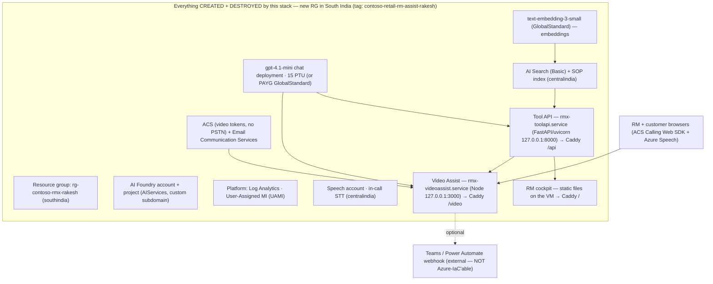

# Technical Handover — Contoso Retail “RM Assist (Rakesh Sharma)”

> ### ⚠️ Read this first — architecture changed after `v2.1.9`
>
> This document was written for the **Container Apps** topology. The stack has since been migrated
> to a **single Ubuntu VM behind Caddy**, and the sections describing infrastructure have been
> **updated in place** to match. Concretely, what changed:
>
> | Then (as first written) | Now |
> |---|---|
> | Tool API, CRM and Video Assist as three **Container Apps** | Three workloads on **one VM**: two systemd units + static files |
> | Images built with `az acr build` and pushed to **ACR** | **No images, no registry.** Sources deployed over SSH (`tar`-over-`ssh`), Python venv + `npm ci` on the VM |
> | A **Container Apps Environment** per build | **Caddy** terminates TLS and path-routes: `/` cockpit · `/api` Tool API · `/video` Video Assist · `/console` Core Banking console |
> | Secrets as **literal Container App secrets** | Root-owned `0600` systemd **`EnvironmentFile`s** on the VM |
> | `wipe.sh` kept the RG by default | `wipe.sh` **purges the whole billable RG by default**; `--keep-rg` is the escape hatch |
>
> **§13 Change history is deliberately NOT rewritten.** It is a record of what each version actually
> did at the time, so it still describes Container Apps, ACR and Key Vault where those were the
> truth. Do not "correct" it — that would falsify the history.
>
> The application-level chapters (§8 data pack, §9 backend, §10 Video Assist runtime, §11 CRM,
> §14 known issues) were **not** affected by the migration and remain accurate.
> For the current topology in full, see `README.md` and `TECHNICAL_REFERENCE.md`.

> **Build:** `contoso-retail-rm-assist-rakesh` · **version `v2.1.9`** (build_date 2026-07-10)
> **Purpose of this document:** a complete, self-contained technical handover of the *latest* build so
> it can be handed to another engineer — or pasted into another AI — with no prior context.

---

## 0. TL;DR

This is a **lean, fully self-contained demo** of an **AI copilot for a bank Relationship Manager (RM)**.
It shows one end-to-end journey — the *Everyday RM Assist* flow for retail customer **Rakesh Sharma
(`CTB-RTL-002`)** — culminating in a **live, AI‑coached video call** where an in‑call engine posts a
running **synopsis + compliance/growth “nudges” + tool answers** into Microsoft Teams as the customer
speaks.

Key properties:

- **All‑or‑nothing IaC.** The stack **creates its own Azure resource group in South India** and
  provisions *everything* inside it (AI Foundry account + project, `gpt‑4.1‑mini` chat deployment,
  `text‑embedding‑3‑small` embedding deployment, AI Search, ACS + Email, Speech, and three Container
  Apps). `wipe.sh` tears the billable stack back down. Nothing is pre‑provisioned or shared.
- **One config file.** Everything is driven by [`infra/common/env.sh`](infra/common/env.sh). No script
  hardcodes configuration. The file lists **every** variable, pre‑filled with the demo values.
- **Two chat‑model modes.** Default is a **15‑PTU** `gpt‑4.1‑mini` (`GlobalProvisionedManaged`); pass
  `--type=payg` for a pay‑as‑you‑go (`GlobalStandard`) deployment instead. Both are CREATED and DELETED
  by the build/wipe.
- **One unavoidable external dependency:** the Teams / Power Automate nudge webhook (a Power Platform
  trigger URL). It cannot be created via Azure IaC, so it is a pre‑filled env var; if empty, the call
  still works and nudges simply don’t post to Teams.

Run model (pick one):

```bash
# One-shot
bash deploy.sh                 # one-shot: foundation + billable stack

# 3-script split (friendlier to locked-down subscriptions)
bash build_persistent.sh       # ONCE, EVER — static public IP (the only standing cost)
bash build_rg.sh               # ONCE — non-billable foundation (RG + Log Analytics + UAMI)
bash build.sh                  # per demo — billable stack (AI services + the application VM)
bash wipe.sh                   # DEFAULT: FULL PURGE of the billable RG (IP + cert preserved)
bash wipe.sh --keep-rg         # keep the RG + platform for a faster next build
```

---

## 1. The demo narrative

The RM (**Priya Nair**, RM‑2207) works a small retail portfolio in a **CRM cockpit** (the dashboard app)
and is coached through a client conversation in seven steps:

1. **Thesis** — why this customer matters now (declining balances, income volatility).
2. **Personas** — who Rakesh is, financially and behaviourally.
3. **Strategy** — the recommended play for the relationship.
4. **Offers** — concrete, compliant product offers grounded in policy (RAG over SOPs).
5. **Pre‑call plan** — talking points and objection handling.
6. **Live video call (Step 7 — the capstone)** — an ACS‑based browser video call. As the customer
   speaks, Azure Speech transcribes each turn; the Video Assist server classifies intent, runs a
   deterministic Tool‑API “tool” for a grounded **answer**, and/or fires a coaching **nudge**
   (STRESS / GROWTH / COMPLIANCE), and posts both to the RM’s Teams chat via the Power Automate webhook.
7. **Scheduling** — a customer‑facing self‑service page to book the follow‑up video call.

**Two contrasting synthetic customers** anchor the data narrative (enforced by the data validator):
- **Ananya (`CTB‑RTL‑001`)** — happy path: income up YoY, clean conduct, strong CIBIL (≥750), ≤1 bounce.
- **Rakesh (`CTB‑RTL‑002`)** — stress path: income down YoY, ≥2 EMI bounces, sub‑700 CIBIL, an open
  disputed (Unauthorized) transaction. This is the customer the live call is built around.

---

## 2. Repository layout

```
contoso-retail-rm-assist-rakesh/
├── deploy.sh                 # one-shot wrapper (BUILD_STAGE=all)
├── build_rg.sh               # split build — non-billable foundation (BUILD_STAGE=foundation)
├── build.sh                  # split build — billable apps (BUILD_STAGE=apps), parses --type
├── wipe.sh                   # teardown wrapper (default keeps RG+platform; --delete-rg = full)
├── VERSION                   # version id + full changelog (v1.0.0 → v2.1.8)
├── README.md                 # operator-facing docs (deploy/wipe, env table, architecture)
├── TECHNICAL_HANDOVER.md     # this document
├── ACS-Teams-Live-Video-Integration.md   # standalone, demo-independent ACS↔Teams live-video guide
├── .gitattributes            # enforce LF for shell/py/js/etc.
│
├── infra/                    # all Infrastructure-as-Code + orchestration
│   ├── common/
│   │   ├── env.sh            # SINGLE SOURCE OF TRUTH for all configuration + helpers
│   │   ├── run_wave.sh       # run N phases concurrently, one log each, heartbeat + rc collection
│   │   └── preflight_validate.sh   # zero-cost gate: data validate + py/node/bash syntax checks
│   ├── rebuild-parallel.sh   # BUILD orchestrator: waves phase0..phase10 (stage-aware)
│   ├── wipe-parallel.sh      # WIPE orchestrator: whole-RG purge (default) OR per-phase teardown
│   ├── phase0-foundation/    # create+tag RG, register providers, tool checks       (up.sh/down.sh)
│   ├── phase1-platform/      # Log Analytics + UAMI                          (up.sh/down.sh/main.bicep)
│   ├── phase2-ai/            # AI Foundry acct+project, chat/voice/embed deployments, Search, ACS, Email,
│   │                         #   Speech, role grants   (up.sh/down.sh/main.bicep + 2 helper scripts)
│   ├── phase3-data/          # validate the committed CSV pack (creates NO Azure resources)
│   ├── phase5-rag/           # create AI Search index + chunk/embed/upload SOPs (create_index.py, index_sops.py)
│   ├── phase10-vmhost/       # THE APPLICATION VM: Ubuntu + Caddy/TLS + all three apps
│   │                         #   up.sh/down.sh/main.bicep/cloud-init.yaml
│   │                         #   Caddyfile.tmpl · rmx-toolapi.service.tmpl · rmx-videoassist.service.tmpl
│   ├── persistent/           # never-wiped RG holding the STATIC PUBLIC IP (build_persistent.sh)
│   └── cert/                 # committed, ENCRYPTED Let's Encrypt store (see tools/cert_store.sh)
│
├── tools/                    # on-VM deploys + repo utilities (all tar-over-ssh, no Docker)
│   ├── deploy-toolapi-on-vm.sh · deploy-crm-on-vm.sh · deploy-videoassist-on-vm.sh
│   ├── deploy-console-on-vm.sh · run-generation-on-vm.sh
│   └── cert_store.sh · commit-artifacts.sh · ensure-baseline.sh
│
├── backend/                  # FastAPI "Tool API" (deterministic evidence + RAG + AI narration)
│   ├── requirements.txt      # pip-installed into a venv on the VM (no image)
│   └── app/
│       ├── main.py           # app factory, CORS, lifespan (loads CSV/KB into in-memory store)
│       ├── config.py         # env-var config (Foundry endpoint, search, ACS, guard flags)
│       ├── deps.py           # bearer-token auth dependency
│       ├── store.py          # in-memory DataStore over the CSV/KB pack (swap seam to SQL/Cosmos)
│       ├── routes/           # acs, analysis, briefing, call_records, rag, voice, workspace
│       └── services/         # analytics, breach_radar, next_best_action, nudge_engine, llm,
│                             #   search, card_limit, collateral, memo, rm_intelligence, ... (30+)
│
├── frontend-crm/             # RM cockpit dashboard (static SPA — Caddy serves it directly at /)
│   └── html/                 # index.html, app.js, ui.js, ui.css, refresh.css
│                             #   config is injected into index.html at DEPLOY time by
│                             #   tools/deploy-crm-on-vm.sh (same tokens the old nginx entrypoint used)
│
├── videoassist/              # Video Assist (Step 7 live call + nudges) — Node/Express + Vite SPA
│   ├── server.js             # Express server: tokens, sessions, transcript intake, scheduling
│   ├── nudge-engine.js       # LLM-driven intent classifier + answer builder + nudge builder
│   ├── toolapi.js            # server-side Tool API client (Entra bearer; no keys in browser)
│   ├── teams.js              # Power Automate webhook formatters (HTML cards)
│   ├── insight-store.js      # bounded in-memory insight ring buffer + SSE hub (/insights/stream)
│   ├── vite.config.js        # `base` from VA_BASE_PATH so bundled assets resolve under /video
│   ├── client/               # SPA: index.html + main.js (ACS Calling + Azure Speech) + styles.css
│   ├── public/               # bank.html/js + schedule.html/js (customer portal + booking page)
│   └── data/customer-portfolio.json   # synthetic fallback portfolio (used if Tool API absent)
│
├── data/
│   ├── csv/                  # 37 committed deterministic CSVs (the demo dataset) — see §10
│   └── knowledge_base/       # product catalog, playbooks, checklist rules, manifests (8 files)
│
└── docs/
    ├── sop/                  # 20 policy SOP markdown files → indexed into AI Search for RAG
    ├── DEMO_TRANSCRIPTS.md
    └── Contoso_MSME_RM_Assist_Call_Transcript_Pack.(md|docx)
```

---

## 3. Architecture & data flow



**Live-call data flow (Step 7):**
1. Customer joins the Video Assist SPA (`/?customer_id=CTB-RTL-002&link=<teams-meeting>`); the browser
   mints an ACS VoIP token from the server (`/token`) and joins the call; Azure Speech (`en-IN`)
   transcribes each turn client‑side.
2. Each final turn is POSTed to the server (`/transcript`).
3. `nudge-engine.js` primes the customer evidence once (parallel Tool‑API fetches), then per turn runs a
   **fast path** (latency‑critical nudge classifier) and a **detailed path** (question planner → runs a
   deterministic Tool‑API tool → formats a grounded answer).
4. `teams.js` posts the synopsis / answer / nudge as HTML cards to the Power Automate webhook, which
   surfaces them in the RM’s Teams chat.
5. All Azure access is via the **user‑assigned managed identity** (Entra) — no keys in the browser; the
   Tool‑API bearer token and Teams webhook are held server‑side only.

---

## 4. Azure resources (per phase, with regions / SKUs / cost posture)

| Phase | Creates | Region | SKU / size | Cost posture |
|------|---------|--------|-----------|--------------|
| **phase0-foundation** | Resource group (tagged); registers RPs | `AZ_REGION` (southindia) | — | free |
| **phase1-platform** | Log Analytics, **User-Assigned MI** | southindia | — | ~free idle |
| **phase2-ai** | **AI Foundry (AIServices) account + project**, **chat deployment**, **voice deployment**, **embed deployment**, **AI Search**, **ACS**, **Email**, **Speech**, role grants | AI/ACS: southindia · Search: `AZ_REGION_SEARCH` (centralindia) · Speech: `AZ_REGION_SPEECH` (centralindia) | Chat `gpt-5.4` + voice `gpt-5.4-mini` + embed: all `GlobalStandard` · Search: **Basic** (~$75/mo) · Speech: S0 | **largest cost** (Search fixed hourly; models per token) |
| **phase3-data** | *(nothing in Azure)* validates the committed CSV pack | — | — | free |
| **phase5-rag** | AI Search index + SOP embeddings (uploaded into the phase2 Search) | centralindia (index) | — | embedding calls only |
| **phase10-vmhost** | **The application VM** (`vm-rmx-host`) + NIC/NSG/VNet, Caddy + TLS, then all three apps deployed onto it, plus the **dedicated video‑token ACS** (`NAME_ACS_VIDEO`, no PSTN) | southindia / ACS Global | `Standard_D4as_v5` (4 vCPU / 16 GB) | VM billed hourly while it exists |
| *(persistent, separate RG)* | **Static public IP** anchoring `rmassist.<ip>.nip.io` | southindia | Standard | a few $/mo — **the only standing cost**, never wiped |

**Why some services leave South India automatically:** `SpeechServices` (standalone Speech account) and
`AI Search` are **not offered in southindia**. `env.sh` defaults `AZ_REGION_SEARCH` and
`AZ_REGION_SPEECH` to **centralindia** (both overridable). They still land in the same resource group.
This was the fix in v2.0.1 (Speech `InvalidApiSetId` in southindia).

**Foundation vs Apps split (build reliability):**
- **FOUNDATION** = phase0 + phase1. No standing cost. Built once by `build_rg.sh`.
- **APPS** = phase2, phase3, phase5, phase10. Billable. Built per demo by `build.sh`; removed by
  `wipe.sh`, which now purges the entire billable RG by default.

---

## 5. Build / deploy / wipe model

All four root scripts are thin wrappers around `infra/rebuild-parallel.sh` (build) or
`infra/wipe-parallel.sh` (wipe). They set `BUILD_STAGE` / `DEPLOY_TYPE` / wipe knobs, then `exec` the
orchestrator. Every one `chmod +x`’s the infra/videoassist shell scripts first.

| Script | Sets | Runs | Notes |
|-------|------|------|-------|
| `deploy.sh` | `BUILD_STAGE=all`, parses `--type=ptu\|payg` | rebuild-parallel (phase0..9) | one-shot |
| `build_rg.sh` | `BUILD_STAGE=foundation` | rebuild-parallel (phase0+phase1 only) | run ONCE; prints “FOUNDATION READY” then exits |
| `build.sh` | `BUILD_STAGE=apps`, parses `--type=ptu\|payg` (strict, exit 2 on bad) | rebuild-parallel (phase2..9) | asserts foundation present; regenerates phase1 outputs.env from Azure if missing |
| `wipe.sh` | default `WIPE_DELETE_RG=0` + `KEEP_PLATFORM=1`; `--delete-rg` → `WIPE_DELETE_RG=1` | wipe-parallel | default keeps RG+platform; `--type` accepted for symmetry (no effect on what’s deleted) |

### `--type=ptu|payg` (chat-model profile)

`env.sh` §4 is a **profile switch** on `DEPLOY_TYPE` (default `ptu`; unknown → warn + fall back to ptu):

| | `--type=ptu` (default) | `--type=payg` |
|---|---|---|
| Deployment name | `gpt-4.1-mini-ptu` | `gpt-4.1-mini-payg` |
| SKU | `GlobalProvisionedManaged` | `GlobalStandard` |
| Capacity | **15** (PTU) | 50 |
| Lifecycle | CREATED by phase2, DELETED on wipe | CREATED by phase2, DELETED on wipe |

Both modes CREATE and DELETE the chat deployment (in the self‑contained model, nothing is “pre‑using”
a permanent deployment). The embedding deployment (`text-embedding-3-small`, `GlobalStandard`, cap 50)
is always created and always deleted. `AOAI_CHAT_PROTECTED_DEPLOYMENTS` is **empty** by default (a guard
that would skip deletion of any listed name).

> **Important PAYG note:** selecting `--type=payg` does **not** create any PTU capacity — it creates a
> `GlobalStandard` deployment only. (The chat‑deployment log line reads `GlobalStandard capacity 50`.)

### Wipe semantics (what actually gets deleted)

- **Default `bash wipe.sh`** → `WIPE_DELETE_RG=1` → **FULL PURGE: deletes the entire billable
  resource group** (the VM and all three apps, Foundry + deployments, Search, ACS, Speech, Log
  Analytics, UAMI) and then **purges** the soft‑deleted Cognitive Services accounts
  (`NAME_AISERVICES` in `AZ_REGION`, `NAME_SPEECH` in `AZ_REGION_SPEECH`) so the globally‑unique
  names free up immediately. The **persistent RG (static IP)** and the committed cert in
  `infra/cert/` are **never** touched — that pair is what keeps the hostname and certificate reusable.
- **`bash wipe.sh --keep-rg`** → `WIPE_DELETE_RG=0`, `KEEP_PLATFORM=1` → per‑phase teardown that
  keeps the RG and the Phase‑1 platform (Log Analytics + UAMI), so the next `build.sh` is faster.
- **Safety guard:** the full wipe refuses to delete an RG that does **not** carry the project tag unless
  `WIPE_FORCE=1`. The per‑phase downs use `assert_project_tag` before any delete.
- **PAYG teardown fix (v2.1.2):** `phase2-ai/down.sh` now **enumerates and deletes every** model
  deployment on the account (both `-ptu` and `-payg`, plus embedding) regardless of `--type`, before the
  account delete — so a bare `wipe.sh` no longer orphans a PAYG deployment (billing stops immediately).

---

## 6. Orchestration internals

### `infra/rebuild-parallel.sh` — build waves

Dependency‑ordered waves (phases within a wave run **concurrently** via `run_wave`):

```
FOUNDATION (skipped when BUILD_STAGE=apps):
  ensure_rg → phase0-foundation → phase1-platform
  (if BUILD_STAGE=foundation: print "Foundation ready" and exit 0)

APPS (skipped when BUILD_STAGE=foundation):
  assert_foundation_present            # only when BUILD_STAGE=apps
  Wave 2:  phase2-ai  ∥  phase3-data
  Wave 3:  phase10-vmhost              # the VM + Caddy + TLS
           tools/run-generation-on-vm.sh        (dataset + SOPs, keyless gpt-5.4)
           tools/deploy-toolapi-on-vm.sh        (systemd, health-gated through Caddy /api)
           tools/deploy-crm-on-vm.sh            (static cockpit at /)
           tools/deploy-videoassist-on-vm.sh    (systemd, /video)
           tools/deploy-console-on-vm.sh        (static console at /console/)
  Wave 4:  phase5-rag                  # index SOPs, then smoke-test RAG via https://<host>/api
```

A failed wave **aborts** the build (a dependency is missing for later waves). Before any Azure login or
resource creation, the **preflight gate** must pass.

### `infra/common/preflight_validate.sh` — zero-cost gate

Runs entirely on local data/tests (no Azure). It runs `phase3-data/up.sh` (validates the committed CSV
pack via `validate_seed.py`), `py_compile` on the backend, `node --check` on the JS, and `bash -n` on
the shell scripts. If anything fails, **the Azure rebuild never starts**.

> **v2.1.5 fix lives here:** previously a wipe deleted `data/csv`, and the next preflight died with a
> *silent* “phase3 exit 1” because `phase3-data/up.sh` computed `find data/csv … | wc -l` under
> `set -euo pipefail` (a missing dir tripped pipefail before the friendly `die`). Fixed by (a) not
> deleting `data/csv` on wipe and (b) guarding the `find` with `|| true` so a missing pack now yields a
> clear error. See §14/§15.

### `infra/common/run_wave.sh`

`run_wave <up|down> <phase>…` launches each phase’s `up.sh`/`down.sh` as a background job (one log file
each under `/tmp/acs_build_logs/`), **auto‑answers interactive prompts** (`printf 'y\nDELETE\nREBUILD\ny\n'`),
prints a heartbeat every ~45s with the last log line, waits for all, and returns non‑zero if any `up`
failed (`down` is best‑effort).

### On-VM deploy scripts (`tools/deploy-*-on-vm.sh`)

These replaced the image pre-build and the ACR cache. Each ships sources with **tar-over-ssh** (only
`tar` + `ssh` needed on both ends — no rsync, no Docker), writes a root-owned `0600` systemd
`EnvironmentFile`, then starts the unit. The Tool API and Video Assist deploys health-check on the VM
loopback **first** — so a failure is unambiguously the app, not Caddy — and then again through Caddy,
which is the real end-to-end proof that the path prefix is being stripped correctly.

`WIPE_PARALLEL_DELETES=1` (default) still deletes independent resources concurrently on teardown.

### phase2 ARM robustness

`phase2-ai/up.sh` submits the Bicep **async** (`--no-wait`), then polls the authoritative ARM state,
prints pending operations on a timer, cancels a timed‑out attempt, and **retries once incrementally**
(completed resources are reused). It also cleans up stale unfinished `phase2-ai-*` deployments before
starting. After the Bicep, it CLI‑creates the chat + embed **model deployments** with **auto‑version
discovery** (`az cognitiveservices account list-models … sort_by(...)[-1].version`). Two idempotent
post‑steps re‑apply an ACS→Cognitive‑Services role grant (transcription) and enable ACS diagnostics.

---

## 7. Configuration — `infra/common/env.sh` (single source of truth)

`env.sh` uses strict mode **only** when run as a script (not when sourced interactively). Grouped
reference of the variables it declares (all overridable from the environment; defaults shown):

### §1 Core Azure context
| Var | Default | Meaning |
|-----|---------|---------|
| `AZ_SUBSCRIPTION_ID` | `ce9b822d-f1a4-45f4-ac2c-f2255ba5dbd8` | target subscription |
| `AZ_TENANT_ID` | `5cc1cdba-5904-4909-bf6a-2289c50333fb` | tenant |
| `AZ_RG` | `rg-contoso-rmx-rakesh` | resource group (**created and deleted** by this build) |
| `AZ_REGION` | `southindia` | primary region (RG + AI + ACS + the application VM) |
| `AZ_REGION_SEARCH` | `centralindia` | AI Search region (not offered in southindia) |
| `AZ_REGION_SPEECH` | `centralindia` | Speech region (SpeechServices not offered in southindia) |
| `PROJECT_TAG_KEY` / `PROJECT_TAG_VALUE` | `project` / `contoso-retail-rm-assist-rakesh` | tag on every resource; teardown safety guard |

### §3 Deterministic suffix
`SUFFIX` = first 5 hex chars of `sha256(subscription | RG | projectTag)` → **`3f45a`** for this env.
Every globally‑unique resource name embeds it.

### §4 Chat + embed model profiles
Driven by `DEPLOY_TYPE` (`ptu` default / `payg`). Resolves `AOAI_CHAT_DEPLOYMENT_NAME`,
`AOAI_CHAT_SKU_NAME`, `AOAI_CHAT_SKU_CAPACITY`, `AOAI_CHAT_MANAGE_LIFECYCLE` from the profile. Knobs:
`AOAI_CHAT_MODEL_NAME` (`gpt-4.1-mini`), `AOAI_CHAT_MODEL_VERSION` (empty → auto‑discover),
`AOAI_CHAT_PTU_*` (name `gpt-4.1-mini-ptu`, `GlobalProvisionedManaged`, 15),
`AOAI_CHAT_PAYG_*` (name `gpt-4.1-mini-payg`, `GlobalStandard`, 50),
`AOAI_CHAT_PROTECTED_DEPLOYMENTS` (empty). Embedding: `AOAI_EMBED_DEPLOYMENT_NAME`
(`text-embedding-3-small`), `AOAI_EMBED_MODEL_NAME`, `AOAI_EMBED_SKU_NAME` (**`GlobalStandard`** —
plain `Standard` is unavailable in southindia, v2.1.1 fix), `AOAI_EMBED_SKU_CAPACITY` (50).

### §5 Net-new resource names (all suffix `3f45a`)
`NAME_LAW`, `NAME_UAMI`, `NAME_AISERVICES`
(`aifndry-rmx-3f45a`), `NAME_FOUNDRY_PROJECT` (`proj-rmx-3f45a`), `NAME_SEARCH` (`srch-rmx-3f45a`),
`NAME_ACS` (`acs-rmx-3f45a`), `NAME_ACS_VIDEO`, `NAME_SPEECH`,
`NAME_VM` (`vm-rmx-host`) + `NAME_VM_NIC` / `NAME_VM_NSG` / `NAME_VM_VNET`,
`SEARCH_INDEX_NAME` (`contoso-retail-policy-index`).
The static IP `NAME_PERSIST_PIP` (`pip-rmx-persist`) lives in the separate, never-wiped
`AZ_RG_PERSISTENT`. `NAME_ACR`, `NAME_ACA_ENV` and the three `NAME_CA_*` names were removed with the
Container Apps.
`EXISTING_*` remain as back‑compat aliases pointing at the created names.

### §6 Video Assist / Speech / ACS derived vars
`AZURE_AI_ENDPOINT` = `https://aifndry-rmx-3f45a.services.ai.azure.com/openai/v1` (Entra auth, no keys),
`AZURE_AI_CHAT_DEPLOYMENT`, `AZURE_AI_EMBED_DEPLOYMENT`, `AZURE_AI_SCOPE`,
`AZURE_SPEECH_REGION` = `AZ_REGION_SPEECH`, `AZURE_SPEECH_RESOURCE_ID` (the dedicated Speech account),
`VOICELIVE_MODEL` (`gpt-4.1`, a managed identifier — no deployment, no cost),
`ACS_DATA_LOCATION` (`India`), voice‑AI deployment overrides, and live‑nudge
timing knobs (`FAST_NUDGE_TIMEOUT_MS` 3400, `FAST_PATH_HEADSTART_MS` 300, `NUDGE_FRESHNESS_MS` 5500,
`NUDGE_TEAMS_TIMEOUT_MS` 5000, `NUDGE_MIN_CONFIDENCE` 0.68).

### §7 Demo runtime
`DEFAULT_CUSTOMER_ID` (`CTB-RTL-002` = Rakesh), `RM_DISPLAY_NAME` (`Priya Nair …`), `ACS_FORCE_DELETE` (1).

### §8 External integration (NOT Azure-IaC'able)
`TEAMS_WEBHOOK_URL` (pre‑filled Power Automate trigger URL; the `sig=` is its own credential),
`TEAMS_NUDGE_WEBHOOK_URL` (optional), `SCHEDULE_WEBHOOK_URL` / `SCHEDULE_AVAILABILITY_WEBHOOK_URL`
(optional Step‑7 flows; empty → synthetic availability + record‑only bookings).

### §8b/§8c Tunables
`WIPE_PARALLEL_DELETES` (1), `BUILD_STAGE` (`all`), plus the VM-era skips
`SKIP_VMHOST` / `SKIP_DATAGEN` / `SKIP_TOOLAPI_VM` / `SKIP_CRM_VM` / `SKIP_VIDEOASSIST_VM` /
`SKIP_CONSOLE` (all default 0). Note `SKIP_VMHOST=1` now means **no applications at all**, since all
three run on that VM. `PREBUILD_IMAGES` and `PHASE5_REBUILD_TOOLAPI` were removed with the container
build.

### §9 Helpers
`log/warn/die/ok/confirm`, `ensure_az_login`, `ensure_rg`, `tag_args`, `assert_project_tag`,
`regen_phase1_outputs` (rebuild `phase1-platform/outputs.env` from Azure if missing),
`assert_foundation_present` (verify RG+UAMI or die “run build_rg.sh first”),
`ensure_toolapi_bearer` (resolve-or-mint the Tool API bearer and export it under BOTH names the
codebase uses — `TOOLAPI_BEARER_TOKEN` for the FastAPI backend, `TOOLAPI_BEARER` for the Node app),
`persist_ip` / `rmassist_host`, `print_demo_urls`.

> **No Key Vault anywhere** (removed for good in v2.1.0). Every app secret now lands in a root-owned
> `0600` systemd `EnvironmentFile` on the VM (`/opt/rmx/etc/rmx.env` shared, plus one per app),
> streamed over SSH stdin so it never appears in `ps` or `/proc/<pid>/cmdline`. Inter‑phase values
> flow through each phase’s `outputs.env`. The deployer never touches a vault data plane, so the
> build is immune to the “Key Vault publicNetworkAccess=Disabled” policy that broke earlier versions.

---

## 8. Data pack (`data/` + `docs/sop/`)

### `data/csv/` — 31 committed, deterministic CSVs (single customer: Rakesh, `CTB-RTL-002`)
Grouped: `01_master_data/` (customer_master, msme_business_profile, promoters_guarantors,
portfolio_assignments, stakeholders), `02_accounts/` (accounts, counterparty_master,
current_account_transactions_fy2025_26, daily_balances, transaction_category_rules),
`03_credit/` (loan_facilities, repayment_history, daily_limit_utilization, collateral_security,
facility_covenants, insurance_status, stock_statements), `04_financials/` (bureau_summary,
financial_statements_summary, gst_returns_monthly, debtor_creditor_aging),
`05_operations/` (document_status, service_requests, consent_registry, cheque_returns),
`06_crm/` (rm_interactions, crm_tasks, opportunities, audit_log, engagement_threads),
`08_rm/` (rm_daily_activity).

> **v2.1.9 — single-customer pack + Customer 360.** The pack is pruned to **only Rakesh Sharma
> (`CTB-RTL-002`)**: every `customer_id` table is filtered to Rakesh, the two other seeded customers
> (Meera `CTB-RTL-001`, Vikram `CTB-RTL-005`) are removed, and the 6 orphaned `CTB-MSME` golden files
> (old `07_voice/` + `08_ai_expected_outputs/`, read by nothing) were deleted. The CRM **Raw Data** tab
> now opens on a one-click **Customer 360** — `GET /v1/rawdata/profile` assembles Rakesh's entire record
> (identity, KYC + blocking docs, accounts, facilities with monthly finance charge, CIBIL, spend-by-
> category analytics, recent transactions, repayments, disputes, documents, guarantors, RM interactions)
> and `frontend-crm/html/app.js` renders it live inside the page.

> This pack is **committed** (ships in the tarball). `phase3-data/up.sh` only **validates** it — it never
> regenerates it. (v2.1.5 stopped the wipe from deleting it.)

### `data/knowledge_base/` (8 files)
`product_catalog.csv`, `product_rules.csv`, `solution_playbooks.csv`, `document_checklist_rules.csv`,
`marketing_templates.csv`, `crm_cases_enriched.csv`, `policy_documents_manifest.csv`,
`ai_generation_manifest.json`.

### `docs/sop/` — 20 policy SOPs → RAG corpus
`01_kyc_and_rekyc` … `20_hardship_restructuring_playbook` (KYC/re‑KYC, card dispute, FOIR eligibility,
fraud, collections & restructuring, insurance, fair practices, consent/DPDP, escalation, source‑of‑funds,
responsible lending, consolidation, microfinance exposure, vulnerable customer, HNI service recovery,
live‑call recovery, retention/rate‑match, guarantor/family liability, on‑call commitment protocol,
hardship restructuring). phase5 chunks, embeds (`text-embedding-3-small`), and uploads these into the
`contoso-retail-policy-index` AI Search index.

### `validate_seed.py` checks (hard‑fail on any error)
1. All expected CSVs present + non‑empty. 2. Referential integrity (customer/account/facility/counterparty
FKs). 3. Per‑transaction running‑balance reconciliation (±1.0 tolerance). 4. Every `cheque_returns` row
cross‑refs an `is_return=Y` transaction. 5. Every repayment links to an EMI debit. 6. **Narrative
contrast** — Ananya income↑/CIBIL≥750/≤1 bounce; Rakesh income↓/CIBIL<700/≥2 bounces + a disputed
(Unauthorized) txn. 7. Golden expected‑output files present.

---

## 9. Backend “Tool API” (FastAPI)

**Three layers:**
1. **Deterministic evidence** (`store.py`, `analytics.py`, `breach_radar.py`, `relationship_decisioning.py`)
   — loads the CSV/KB pack into an in‑memory `DataStore` at startup and computes auditable numbers
   (utilization %, EWS signals, account‑conduct score, days‑to‑breach). No LLM.
2. **Decision intelligence** (`next_best_action.py`, `command_center.py`, `card_limit.py`,
   `collateral.py`, `crosssell.py`, `daily_planner.py`) — applies SOP rules + eligibility gates + hard
   guardrails (no auto‑approval, consent checks, blocker awareness). Deterministic.
3. **AI narration** (`llm.py`, `rm_intelligence.py`, `briefing_story.py`, `narrative.py`, `memo.py`,
   `demo_intelligence.py`) — takes the evidence/decision packs and asks the Foundry chat model to
   explain / phrase / prioritise. **Degrades gracefully** to deterministic fallback text if the LLM is
   unavailable; never invents figures or approvals.

**Routes** (`app/routes/`): `briefing` (thesis / briefing‑studio / live‑call‑playbook), `analysis`
(360 / command‑center / breach‑radar / EWS / next‑best‑action), `rag` (`POST /v1/rag/retrieve` — policy
search over AI Search), `voice` (in‑browser session lifecycle + transcript intake + wrap‑up),
`acs` (ACS Call‑Automation PSTN mode + callback/transcription webhooks), `call_records`
(persist/download call transcripts), `workspace`. All protected routes require the Tool‑API **bearer
token** (`deps.require_bearer`); ACS callback endpoints are unauthenticated by necessity.

**Guardrails:** `ALLOW_CREDIT_DECISIONS` (default false) rejects any write asserting an approval/sanction;
CRM writes are **human‑in‑the‑loop** (propose → `pending_approval` → RM approves); a **glass‑box audit
trail** logs every material event; PII is masked before any LLM call (email/phone/PAN/GSTIN/Aadhaar/acct).

**Config (`config.py`) / runtime:** env‑driven (`FOUNDRY_AOAI_ENDPOINT`, `FOUNDRY_CHAT_DEPLOYMENT`,
`FOUNDRY_EMBED_DEPLOYMENT`, `SEARCH_ENDPOINT`, `SEARCH_INDEX_NAME`, `ACS_*`, `DATA_DIR`, `KB_DIR`,
`SOP_DIR`, `CORS_ORIGINS`, `TOOLAPI_BEARER_TOKEN`). Runs as `rmx-toolapi.service`:
`uvicorn app.main:app --host 127.0.0.1 --port 8000` inside a venv, as an unprivileged service
account; `/healthz`. `env.sh:ensure_toolapi_bearer` mints the bearer **once**, persists it to the
git-ignored `infra/common/secrets.env`, and every consumer reads it from there (Key‑Vault‑free).
Note `SOP_DIR` points at `data/sop` on the VM, populated from the repo's `docs/sop` — the deploy
reproduces the rename the old image performed.

> Some default strings in `config.py` still carry MSME‑era names (e.g. a `contoso-msme-policy-index`
> default, `dev-bearer-change-me`), but **`env.sh` + the phase scripts override them all at deploy time**
> (e.g. `SEARCH_INDEX_NAME=contoso-retail-policy-index`, a random bearer). Defaults matter only if you run
> the container with no env.

---

## 10. Video Assist runtime (`videoassist/`) — the live call + nudges

**Server (`server.js`, Express, Node 20 ESM):** mints ACS VoIP tokens (`/token`) and Speech tokens
(`/speech/token`); session lifecycle (`/session/start|current|finalize`); live transcript intake
(`/transcript`, `/transcript/preview`); coordinates the **dual workflow** (fast nudge + detailed
answer); case‑consent workflow (propose → confirm → write to CRM); Step‑7 scheduling
(`/availability`, `/bookings`, `/bookings/{id}`, `/bookings/{id}/link`); serves the SPA. Reads
`ACS_CONNECTION_STRING`, `TEAMS_WEBHOOK_URL`, `TOOLAPI_URL`/`TOOLAPI_BEARER`, and the nudge timing knobs.

**`nudge-engine.js` (LLM‑driven):** `primeCustomer(cid)` fetches all Tool‑API evidence in parallel and
caches it for the call. Per turn:
- `evaluateNudgeFast()` — latency‑critical classifier (scenarios: attrition, interest_relief,
  dispute_distress, hardship, compliance, growth) → renders `{nudge, say, basis}` from **real numbers**.
- `respond()` — a **question planner**: LLM classifies `question` vs `direct_answer` vs `case_workflow`,
  picks a tool (transactions, cases, card, loans, kyc, dispute, interest_relief, repayments,
  card_limit, …), runs the **deterministic** tool via `toolapi.js`, and formats a grounded answer.

**`toolapi.js`:** server‑side Tool‑API client using the shared UAMI (Entra bearer; **no keys in the
browser**): `getRawFacts`, `get360`, `getNextBestAction`, `getTransactionInsights`,
`getCardLimitAssessment` / `initiateCardLimitReview`, `crmPropose`/`crmApprove`, `getLiveCallPlaybook`,
`getCrmTimeline`, `ragRetrieve`, `saveCallRecord`.

**`teams.js`:** formats light‑HTML cards for Power Automate — `synopsisText`, `answerText` (with runtime
metrics), `nudgeText` (“Say to customer” + “Policy basis”), case‑consent/clarify/logged, and
transcript‑ready cards. 6s abort‑aware timeout.

**Client (`client/`):** `index.html` shell + `main.js` (ES module) that joins the ACS call via the
meeting link, runs Azure Speech continuous recognition (`en-IN`, 400ms silence), debounces a preview,
sends authoritative turns to `/transcript`, refreshes the token, and renders local/remote video with
mic/cam/leave controls; `?debug=1` enables manual utterance simulation. `public/schedule.*` is the Step‑7
booking page (loads availability, requests a slot, polls for the meeting link, joins).

**Latency targets:** fast nudge < 3.4s; nudge freshness < 5.5s; Teams post ≤ 5s; end‑to‑end ~6–7s from
utterance to the nudge appearing in the RM’s Teams chat. One active call at a time (in‑memory session).

### Answer‑quality fixes confirmed present in this build (v2.1.3 → v2.1.5, substantially expanded in v2.1.6)
- **KYC operation‑aware** (`nudge-engine.js`): “Can you do my KYC / re‑KYC on this call, right now?” is
  treated as an **action request** (`kyc/request`) and answers what actually happens — the live video
  re‑KYC (V‑CIP) capture, identity check, maker‑checker submission, and that completing it unblocks
  credit/limit/restructuring — instead of restating “KYC status is Due…”. Tool label `kyc.rekyc_on_call`.
  Explicit safety line: *never asks for full card number, PIN, OTP or password*.
- **`repayments.summary`** now includes the card outstanding vs limit at APR and uses affordability‑review
  language (“subject to eligibility and the bank’s approval and cannot be confirmed on this call, but I
  can start that review for you”) rather than only listing delayed‑EMI/return counts.
- **Classifier example** trains the LLM to map “do my KYC now” → `kyc/request` with
  `customer_authorises_action=true`.

Other built‑in controls: no duplicate cases (continuity check vs open CRM items); SOP‑exhaustion gate
before seeking case consent; consent gating (explicit confirm + later semantic confirmation ≥ 0.72);
no blanket waivers; card‑limit never pre‑approved on call; no generic reassurance when a concrete plan
is possible.

---

## 11. CRM dashboard (`frontend-crm/`)

A static SPA (`html/index.html` + `app.js` + `ui.js` + `ui.css`) served **directly by Caddy** from
`/opt/rmx/web` at `/`. `tools/deploy-crm-on-vm.sh` injects runtime config (Tool‑API URL, bearer,
Video Assist URL) into `index.html` at **deploy** time, using the same three placeholder tokens the
old nginx entrypoint used. It renders the RM cockpit and the 7‑step RM‑Assist journey with an
outcome‑first hero
(“Today’s AI‑driven outcome”: stance + one move + guardrail + open‑case counts) sharing one
next‑best‑action fetch with the Strategy/Planner tabs. The deploy injects `VIDEOASSIST_URL`
(`https://<host>/video`) so **Step 7**
launches the video call pre‑bound to `CTB-RTL-002`.

---

## 12. Standalone ACS ↔ Teams live-video guide (`ACS-Teams-Live-Video-Integration.md`)

A **demo‑independent**, no‑npm, HTTPS‑correct walkthrough for integrating an ACS browser video call with
a Teams meeting (no nudges, no demo data) — for customer enablement. Key points baked in:
- A plain `http://<vm-ip>:8080` origin is **not a browser secure context**, so `getUserMedia`
  (camera/mic) is blocked. `http://localhost` only works if the browser runs on the same box.
- Solution: a **single static `index.html`** that loads the ACS Calling Web SDK straight from a CDN as
  browser **ESM** (jsDelivr `/+esm` for `@azure/communication-calling@1.43.1`, which auto‑resolves
  `@azure/logger` + `@azure/communication-common`) inside `<script type="module">` — nothing to install
  or build.
- Hosted on an **Azure Storage static website** → real HTTPS (`https://<acct>.z<nn>.web.core.windows.net`),
  a secure context, anonymous, and unaffected by the account’s “allow blob public access” flag.
- The VoIP token is minted with `az communication identity token issue --scope voip` and **pasted** into
  the page — so the deployed file holds **no secrets** and there is no token server.
- Provisioning (ACS + storage static website), upload, token, and teardown are all `az`; every value is a
  variable at the top of the file. Runs in parallel to the main demo (its own `rg-acs-teams-demo` RG).

---

## 13. Change history (highlights)

| Version | What changed |
|---------|--------------|
| **v2.1.8** | **FEATURE:** new **"Raw Data" cockpit tab** so the RM can *prove* the demo is fact‑backed — it opens the exact source records and Indian‑banking SOPs live inside the CRM during the call. **BACKEND:** read‑only, bearer‑gated `backend/app/routes/rawdata.py` — `GET /v1/rawdata/catalog` (grouped manifest) + `GET /v1/rawdata/file?id=…` (raw content), path‑traversal‑safe across three baked roots (`data/csv`, `data/knowledge_base`, `docs/sop`); `config.py` gains `sop_dir`; `backend/Dockerfile` bakes `docs/sop` into the image; `main.py` registers the router. **FRONTEND:** a "Raw Data" menubar item opens a two‑pane explorer — searchable grouped list + renderer that shows CSV as a sortable/filterable table, JSON syntax‑highlighted, and Markdown SOPs rendered; namespaced `.rd-*` CSS in `ui.css` (no‑store), zero new deps, everything HTML‑escaped. **VERIFY:** live‑call answer/nudge engine reconfirmed already‑overhauled in v2.1.6 and left intact; wipe/build rechecked (`bash -n` clean, backend context includes `docs/sop`, frontend ships `frontend-crm/html`), `validate_seed.py` 13/13, rawdata endpoints pass a TestClient integration. Additive — no data/answer/nudge changes. |
| **v2.1.7** | **FIX (infra):** phase2-ai now self-heals a stuck AI Search. A terminal `Failed` Search (regional capacity blip) was REUSED by the Incremental redeploy, so in-run retries and every fresh `build.sh` failed identically on `srch-rmx-<suffix>` until a manual delete or full wipe. `up.sh` deletes a `failed`/`canceled` Search (by its deterministic name) at the top of each deploy attempt so it recreates clean; a healthy or still-provisioning Search is left untouched and reused. AI Search stays in `AZ_REGION_SEARCH` (default `centralindia`), baked in with no runtime export. |
| **v2.1.6** | **CONTENT:** live‑call answer + nudge overhaul for the Rakesh POC — all ~22 demo moments now tell one coherent, SOP‑grounded story. **DATA:** fixed the 2‑vs‑3 bounced‑EMI contradiction across the CSV pack; the PL is a genuine **SMA‑1** (~50 dpd, next EMI 2026‑06‑07). **EVIDENCE:** new `retail_reference.py` is the single source of truth for every derived number (finance charge, fees, consolidation, prepayment/foreclosure, retention), wired into `facts["reference"]`; KYC facts gain `pending_documents` + `blocking`. **ENGINE:** `nudge-engine.js` gains 8 grounded answer tools (verify_caller, fees, restructuring, consolidation, prepayment, sma, retention, guarantor) + upgraded card/kyc/credit_score/loans answers + scam/attrition/hardship nudges citing the real figures; classifier prompts extended; SOP‑16/17 aligned. Deterministic — the LLM only classifies. |
| **v2.1.5** | **FIX:** wipe deleted the committed `data/csv` pack (phase3 down did `rm -rf data/csv`) → rebuilds failed at preflight with a silent “phase3 exit 1”. Fixed: phase3 down is now a no‑op preserving `data/csv`/`knowledge_base`/`sop`; `up.sh` hardened so a missing pack yields a clear error. Wipe→rebuild is idempotent. |
| **v2.1.4** | ACS↔Teams guide fully rewritten: no npm/webpack/server; static `index.html` via jsDelivr `/+esm`; Azure Storage static‑website HTTPS; `az`‑minted VoIP token pasted in. |
| **v2.1.3** | Sharpened vague live‑call answers (KYC operation‑aware `kyc.rekyc_on_call`; `repayments.summary` with card+APR+affordability); added the standalone ACS↔Teams doc. |
| **v2.1.2** | **FIX:** default `wipe.sh` could orphan the PAYG deployment. phase2 down now enumerates + deletes **every** model deployment regardless of `--type`. |
| **v2.1.1** | **FIX:** embedding SKU — southindia offers `text-embedding-3-small` only as `GlobalStandard` (not plain `Standard`). |
| **v2.1.0** | **Key Vault removed entirely** — every app secret is now a literal Container App secret; build is immune to KV public‑access policy. |
| **v2.0.2** | Split into `build_rg.sh` / `build.sh` / `wipe.sh`; default wipe keeps RG + platform. |
| **v2.0.1** | **FIX:** SpeechServices not offered in southindia → dedicated Speech account + `AZ_REGION_SPEECH=centralindia`. |
| **v2.0.0** | Architectural inversion — self‑contained, all‑or‑nothing **new‑RG South India** build (no reuse). |
| **v1.0.4/5** | `--type=payg` profile switch; deploy/wipe speed pass (parallel prebuild + parallel teardown). |
| **v1.0.0** | Initial lean extraction of the Rakesh RM‑Assist journey with complete IaC. |

---

## 14. Known issues, gotchas, and region constraints

- **Region/quota (only verifiable on your Azure):** `gpt-4.1-mini` and `text-embedding-3-small` must be
  offered on the AIServices account in `AZ_REGION` (southindia); the PTU path needs
  `GlobalProvisionedManaged` quota; embedding needs `GlobalStandard`. If model creation fails, change
  `AZ_REGION` in `env.sh`. Foundry project child creation (`allowProjectManagement`) must be supported.
- **AI Search + Speech leave southindia automatically** (centralindia). Overridable, but don’t point them
  back at southindia.
- **Teams webhook is external.** If `TEAMS_WEBHOOK_URL` is empty the call still works; nudges just don’t
  post to Teams. The `sig=` in the URL is its own credential (does not rotate).
- **The committed CSV pack must be present.** If it’s ever deleted, the preflight fails. See §15.
- **One live call at a time** (in‑memory session state — this is a POC/demo, not a multi‑tenant service).
- **Do not `create` files on Windows without LF‑normalizing** — the repo enforces LF (`.gitattributes`);
  the editor’s `create` emits CRLF, which can break shell scripts.

---

## 15. Recovery procedures

**Rebuild fails at preflight with “Generate and validate deterministic datasets (exit 1)”** — the
committed `data/csv` pack is missing (an old wipe deleted it). Restore *only* `data/csv` from your
tarball while preserving your `env.sh`:

```bash
cd ~ && tar -xzf contoso-retail-rm-assist-rakesh-v2.1.8.tar.gz -C ~ contoso-retail-rm-assist-rakesh/data/csv
```

(In v2.1.5 the wipe no longer deletes the pack, so this can’t recur once you’re on v2.1.5.)

**phase1 outputs missing when running `build.sh` in a fresh checkout** — `assert_foundation_present`
calls `regen_phase1_outputs`, which reconstructs `phase1-platform/outputs.env` from Azure
(the UAMI). If the UAMI is truly absent it tells you to run `build_rg.sh` first. `phase10-vmhost`
also calls the same helper directly, so running that phase standalone in a fresh clone self-heals
instead of dying.

**Names won’t free up after a full wipe** — the full wipe purges soft‑deleted CogSvc accounts
(`NAME_AISERVICES`, `NAME_SPEECH`). If a purge failed, run:
`az cognitiveservices account purge --name <name> --resource-group <rg> --location <region>`.

---

## 16. Operational runbook (exact commands)

**Extract + verify (v2.1.8):**
```bash
cd "$HOME"
sha256sum -c contoso-retail-rm-assist-rakesh-v2.1.8.tar.gz.sha256   # verify against the shipped sidecar
rm -rf "$HOME/contoso-retail-rm-assist-rakesh"
tar -xzf "$HOME/contoso-retail-rm-assist-rakesh-v2.1.8.tar.gz" -C "$HOME"
cd "$HOME/contoso-retail-rm-assist-rakesh"
chmod +x deploy.sh build_rg.sh build.sh wipe.sh
```

**One-shot build:**
```bash
bash deploy.sh                 # foundation + billable stack in one process
```

**Split build (recommended for locked-down subs):**
```bash
bash build_persistent.sh       # ONCE, EVER — static public IP (the only standing cost)
bash build_rg.sh               # ONCE — non-billable foundation (RG + Log Analytics + UAMI)
bash build.sh                  # per demo — billable stack (AI services + the application VM)
```

**Wipe:**
```bash
bash wipe.sh                   # KEEP the RG + platform; delete only the billable stack (re-run build.sh after)
bash wipe.sh --delete-rg       # FULL: delete the entire RG + purge soft-deleted CogSvc names
```

**Health checks (after a build):**
```bash
curl -fsS "$TOOLAPI_URL/healthz"
curl -fsS "$DASH_URL/healthz"
curl -fsS "$VIDEOASSIST_URL/healthz"     # returns aiReady, grounding, teamsConfigured
# Step 7 launch pattern:
#   $VIDEOASSIST_URL/?customer_id=CTB-RTL-002
```

**Prerequisites on the runner:** `az` (logged in to the subscription in `env.sh`), `jq`, `curl`,
`python3`, `sha256sum`, `ssh`, `tar`, and the `communication` az extension (auto‑installed). Docker
is **not** required — and is no longer used anywhere: the three applications are deployed onto the
VM from source over SSH.

---

*End of technical handover — `contoso-retail-rm-assist-rakesh` v2.1.8.*
