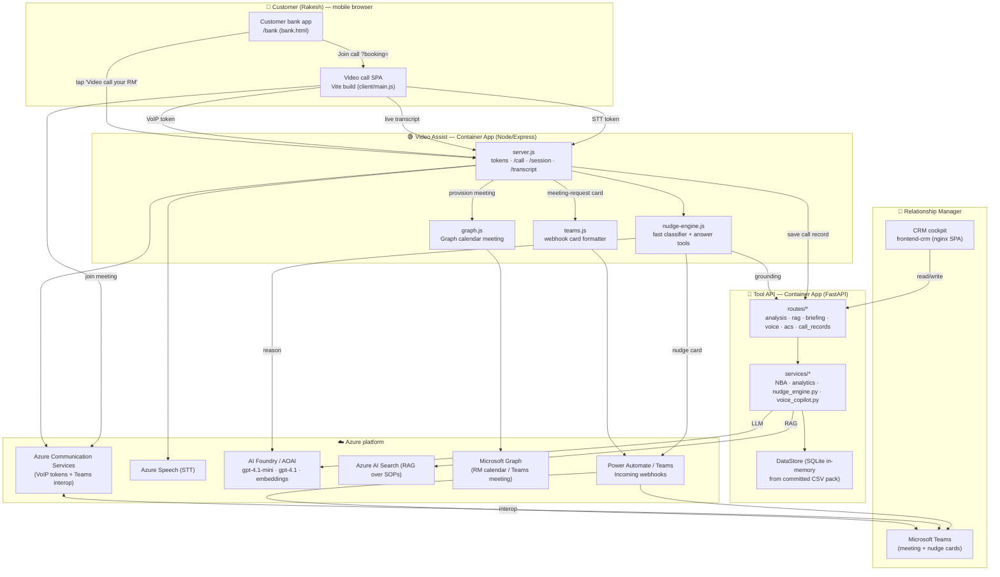
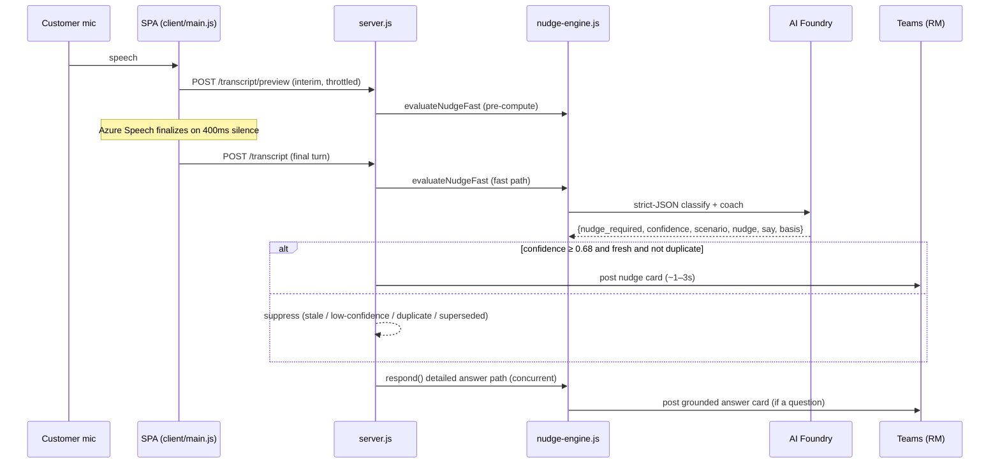

# Contoso Retail RM Assist — Rakesh — Technical Reference

> **Version:** v2.5.0 · **Build date:** 2026-07-11 · **Status:** Gold reference
> **Repository:** `contoso-retail-rm-assist-rakesh` (published privately as `hrshl-demo/contoso-retail-acs-rm-assist-videocall`)
> **Scenario:** Retail HNI relationship-banking demo — customer **Rakesh Sharma** (`CTB-RTL-002`)

---

## 0. How to use this document

This is the **single authoritative technical reference** for the project. It is written so that a person — or another GitHub Copilot / LLM chat session — who has never seen the repository can read this file and gain a complete, accurate mental model of *what the system is, how every part is built, how the parts integrate, and how to deploy, operate, and wipe it*.

If you are an AI assistant picking up this project cold: **read this whole file first.** It supersedes the older, thinner `TECHNICAL_HANDOVER.md`. Where this document and older docs disagree, this document (v2.5.0) is correct — most notably, **the demo now sends zero email** (see §15).

Conventions used here:

- `code font` = an exact file path, command, environment variable, endpoint, or identifier — reproduce it verbatim.
- Money is in Indian Rupees (₹). Lakh = ₹100,000; Crore = ₹10,000,000.
- "RM" = Relationship Manager. "The customer" = Rakesh Sharma unless stated.
- Resource-name suffixes like `${SUFFIX}` are a deterministic per-subscription hash, so real names look like `acrrmx3f45a`, `srch-rmx-3f45a`, etc.

---

## 1. Executive summary

**What it is:** A production-shaped proof-of-concept for an AI-assisted retail banking "video call with your Relationship Manager" experience, plus the RM-side cockpit that powers it.

**The headline journey (Rakesh):**

1. Rakesh opens the **customer mobile banking portal** (a logged-in web app) and taps **"Video call your RM."**
2. The server **automatically** provisions a real RM-side Microsoft Teams meeting. **Rakesh never sees a meeting link** — he only sees a countdown, then a **"Join call"** button.
3. A **meeting-request card is posted to the RM's Teams** the instant the call is scheduled. For the demo, the call goes live **~60 seconds** after the tap (`CALL_LEAD_SECONDS`).
4. Rakesh taps **Join call** and is dropped into the RM's Teams meeting through **ACS ↔ Teams interoperability** (browser → Azure Communication Services → the RM's Teams meeting).
5. During the call, **Azure Speech transcribes Rakesh live**, an **AI "nudge" engine** grounds on his real data + bank SOPs, and **coaching nudges + grounded answers are pushed to the RM's Teams** in ~1–3 seconds — the customer never sees them.
6. On hang-up, the **role-tagged transcript + AI/CRM events are saved to the CRM** as a downloadable call record.

**Three surfaces, one brain:**

| Surface | Tech | Who uses it | Role |
|---|---|---|---|
| **CRM cockpit** (`frontend-crm`) | static SPA on nginx | Relationship Manager | System-of-record + AI "RM Assist" 7-step journey |
| **Video Assist** (`videoassist`) | Node/Express + browser SPA | Customer (mobile bank app) + RM (Teams) | Live video call, live STT, live nudges, scheduling |
| **Tool API** (`backend`) | Python FastAPI | Both of the above (server-to-server) | The grounded "brain": customer data, analytics, RAG/SOP, CRM writes, call records |

Everything is grounded on a **committed, deterministic data pack** (CSV + SOP markdown) so the demo is reproducible offline and produces the exact same Rakesh "stress story" every time.

---

## 2. The Rakesh Sharma scenario (the demo's spine)

`CTB-RTL-002` — **Rakesh Sharma**, ~41, Contoso Priority Banking, customer since 2022, Pune (Camp) branch. The data pack is deliberately a **single-customer pack** locked to Rakesh (the seed validator enforces this).

**The "stress story" — every number below is baked into the CSV pack and asserted by `validate_seed.py`:**

| Signal | Value | Why it matters |
|---|---|---|
| Income (YoY) | ₹144 L → ₹112 L (**down ~22%**) | Affordability stress; the trigger, not unwillingness |
| Personal Loan | **₹4.1 L** outstanding of ₹6.0 L, EMI **₹18,900** @ **16.5%** | SMA-1 classification |
| EMI bounces | **2** (2026-04-07, 2026-05-07), ~50 DPD oldest | SMA-1; ~41 days to NPA |
| Credit card | **₹3.06 L** outstanding vs **₹3.00 L** limit @ **42%** APR | Over-limit; costly balance to consolidate |
| CIBIL | **642** (subprime, "Needs attention", fell ~63 pts) | Below 700 — blocks limit increases |
| Disputed txn | **1** — ₹48.5K GlobalMart charge (chargeback filed) | Distress / service-recovery topic |
| KYC | Video re-KYC **overdue** (blocking) | Compliance blocker |

**The correct AI posture** (what the nudges push the RM toward): **Collect / restructure**, not sell. Offer a step-down EMI / short moratorium / consolidate the 42% card; log a rate-review; resolve the dispute; retention against a competitor offer. Never promise approval, waiver, or a limit increase (blocked by declining income + SMA-1 + subprime CIBIL).

---

## 3. High-level architecture



**Trust boundaries:** the Teams webhook URL, the Tool API bearer, and Graph client secret are **server-side only** — never sent to the customer browser. The customer browser only ever receives a short-lived ACS VoIP token, a short-lived Speech token, and (opaquely, only when the call is live) the Teams join link.

---

## 4. Repository layout

```
contoso-retail-rm-assist-rakesh/
├── VERSION                         # human-readable version + detailed changelog (source of truth for history)
├── README.md                       # operator-facing setup + deploy overview
├── TECHNICAL_HANDOVER.md           # older, thinner handover (superseded by THIS file)
├── TECHNICAL_REFERENCE.md          # ← this document
├── ACS-Teams-Live-Video-Integration.md  # deep note on the ACS↔Teams interop design
├── LICENSE                         # MIT
├── build_persistent.sh             # ONE-TIME persistent RG + static IP (anchors reusable cert)
├── build.sh                        # billable stack build (phases 2–10 + VM data-gen), --regenerate-data
├── build_rg.sh                     # one-time non-billable foundation (RG + phases 0–1)
├── deploy.sh                       # one-shot greenfield build (RG + phases 0–10)
├── wipe.sh                         # teardown; default keeps RG+platform, --delete-rg = full purge
├── setup-graph.sh                  # creates Entra app + Graph Calendars.ReadWrite + consent
│
├── backend/                        # Tool API — the grounded brain (Python FastAPI)
│   ├── Dockerfile
│   ├── requirements.txt
│   └── app/
│       ├── main.py                 # FastAPI app factory + router registration
│       ├── config.py               # pydantic Settings (all backend env vars)
│       ├── deps.py                 # require_bearer, get_store
│       ├── store.py                # DataStore: loads CSV pack into query-able tables
│       ├── routes/                 # analysis, rag, briefing, voice(+ws), acs(+ws), call_records, rawdata, workspace
│       └── services/               # NBA, analytics, nudge_engine.py, voice_copilot.py, call_wrapup, card_limit, …
│
├── frontend-crm/                   # RM cockpit (static SPA served by nginx)
│   ├── Dockerfile                  # nginx-unprivileged :8080
│   ├── nginx/{default.conf,10-inject-config.sh}
│   └── html/{index.html,app.js,ui.js,ui.css,refresh.css}
│
├── videoassist/                    # Live video call service (Node/Express + browser SPA)
│   ├── server.js                   # Express endpoints (tokens, call, session, transcript, bank, schedule)
│   ├── nudge-engine.js             # fast classifier + grounded answer tools (the live-call AI)
│   ├── toolapi.js                  # server-side client for the Tool API (bearer held server-side)
│   ├── teams.js                    # Teams webhook card formatter (nudge/synopsis/answer/call-request)
│   ├── graph.js                    # Microsoft Graph app-only RM calendar/Teams meeting creation
│   ├── client/main.js              # Vite SPA: ACS calling + Azure Speech STT + opaque join
│   ├── public/                     # bank.html/js/css (customer portal), schedule.html/js/css
│   └── Dockerfile
│
├── data/                           # the deterministic data pack (CSV domains + knowledge_base + sop/)
│   └── (01_master_data … 06_crm, knowledge_base/, sop/*.md)
│
├── infra/                          # the phased build/wipe engine
│   ├── common/{env.sh,preflight_validate.sh, …}   # central config + local validation gate
│   ├── phase0-foundation/ … phase9-videoassist/    # one folder per phase (up.sh/down.sh/*.bicep)
│   ├── rebuild-parallel.sh         # dependency-aware parallel build driver
│   └── wipe-parallel.sh            # parallel teardown driver
│
├── scripts/setup-github-oidc.sh    # one-shot Azure↔GitHub OIDC trust + repo secrets
├── docs/{CICD.md,ENTRA_PIM_ADMIN.md,POWER_AUTOMATE.md}
├── .github/workflows/{ci.yml,deploy.yml,wipe.yml}
└── .vscode/tasks.json              # one-click Build/Wipe/Git-pull tasks (VS Code Remote-SSH)
```

---

## 5. Component deep-dive A — Tool API (`backend`, FastAPI)

The Tool API is the **grounded brain and system-of-record**. Title (in `main.py`): *"Contoso MSME RM Assist Tool API"* — the codebase originated from an MSME scenario and was repurposed for the retail Rakesh pack; the "MSME" naming survives in some identifiers but the running data is retail.

### 5.1 App bootstrap (`app/main.py`)

- `create_app()` builds a `FastAPI` app, adds permissive CORS (origins from `CORS_ORIGINS`), and registers routers: `analysis`, `rag`, `briefing`, `workspace`, `voice` (+ `voice.ws_router`), `acs` (+ `acs.ws_router`), `call_records`, `rawdata`.
- **Lifespan startup** loads the data pack once: `DataStore().load(settings.data_dir, settings.kb_dir)` → logs `"Loaded N tables, M transactions"`.
- `GET /healthz` → `{ok, service, version}` (unauthenticated).

### 5.2 Configuration (`app/config.py`, pydantic `Settings`)

Values come from environment variables (Container App injects Key Vault–referenced secrets). Key groups:

| Group | Variables (alias) | Notes |
|---|---|---|
| Service identity | `service_name=contoso-msme-toolapi`, `service_version=1.13.0-explainable-evidence-ledger`, `LOG_LEVEL` | version string is the API's own, independent of the repo `VERSION` |
| Data paths | `DATA_DIR=/app/data/csv`, `KB_DIR=/app/data/knowledge_base`, `SOP_DIR=/app/data/sop` | baked into the image |
| Auth | `TOOLAPI_BEARER_TOKEN`, `CRM_OPERATOR_USERNAME/PASSWORD`, `OPERATOR_SESSION_SECRET`, `OPERATOR_COOKIE_SECURE` | bearer gates `/v1/*` |
| Foundry / AOAI | `FOUNDRY_ENDPOINT`, `FOUNDRY_AOAI_ENDPOINT`, `FOUNDRY_CHAT_DEPLOYMENT=gpt-4.1-mini`, `FOUNDRY_EMBED_DEPLOYMENT=text-embedding-3-small`, `FOUNDRY_VOICELIVE_MODEL=gpt-4.1`, `FOUNDRY_VOICELIVE_WS_ENDPOINT` | Entra auth, no keys |
| Search | `SEARCH_ENDPOINT`, `SEARCH_INDEX_NAME=contoso-msme-policy-index` | RAG index (retail index name overridden by infra to `contoso-retail-policy-index`) |
| ACS phone mode | `ACS_ENDPOINT`, `ACS_CONNECTION_STRING`, `ACS_CALLER_NUMBER=+18662327316`, `ACS_DEFAULT_RM_PHONE`, `ACS_DEFAULT_CUSTOMER_PHONE`, `ACS_PUBLIC_BASE_URL`, `ACS_TRANSCRIPTION_LOCALE=en-US` | powers the backend's own PSTN call-automation copilot (see §5.5) |
| Guardrail | `ALLOW_CREDIT_DECISIONS=false` | belt-and-braces: services refuse to write "approved" credit status |

### 5.3 Data store (`app/store.py`)

`DataStore` loads the committed CSV pack into in-memory, query-able tables (`store.all("transactions")`, `store.one("customer_master", customer_id=…)`). The whole customer 360 — accounts, loans, bounces, bureau, disputes, cases, tasks, opportunities, documents — is derived from these tables at request time. No external database; the pack **is** the database, which is what makes the demo deterministic.

### 5.4 The analytical + CRM API (`routes/analysis.py`, prefix `/v1`, bearer-protected)

All read endpoints return **evidence-cited** analysis; all writes are **approval-gated** (propose → approve) and emit audit events. The most important endpoints (also the ones Video Assist consumes server-side via `toolapi.js`):

| Method + path | Purpose |
|---|---|
| `GET /v1/portfolio/priority-queue` | RM's ranked customer queue |
| `GET /v1/customers/{cid}/360` | consolidated customer 360 |
| `GET /v1/customers/{cid}/raw-facts` | rich citable evidence pack (no AI synthesis) |
| `GET /v1/customers/{cid}/command-center` | cockpit composite |
| `GET /v1/customers/{cid}/credit-readiness` | deterministic credit posture |
| `GET /v1/customers/{cid}/opportunity-workbench` | eligibility-gated opportunities |
| `GET /v1/customers/{cid}/next-best-action` | flagship NBA: SOP-grounded plays + talk-tracks + do-not-offer list |
| `GET /v1/customers/{cid}/enhancement` | limit-enhancement eligibility (blockers/band/caveats) |
| `GET /v1/customers/{cid}/cross-sell` | eligibility-checked cross-sell |
| `GET /v1/customers/{cid}/ews?narrative=false` | deterministic early-warning signals |
| `GET /v1/customers/{cid}/crm-timeline` | interactions, cases, tasks, opportunities |
| `GET /v1/customers/{cid}/relationship-dossier` | full dossier |
| `GET /v1/customers/{cid}/live-call-playbook` | compact in-call operating playbook |
| `GET /v1/customers/{cid}/transactions/recent?limit=N` | recent transactions |
| `GET /v1/customers/{cid}/transactions/insights` | pre-warmed transaction views |
| `POST /v1/customers/{cid}/transactions/query` | AI-planned transaction query |
| `GET /v1/customers/{cid}/card-limit-assessment` | deterministic card-limit pre-screen |
| `POST /v1/customers/{cid}/card-limit-review` | approval-gated card-limit review request |
| `GET /v1/customers/{cid}/breach-radar` · `…/breach-simulate` | covenant/limit breach radar |
| `POST /v1/crm/update-candidate` | **propose** a CRM write (task/interaction/opportunity) |
| `POST /v1/crm/approve-update` | **approve** a proposed candidate → materialises into CRM tables |
| `POST /v1/rag/retrieve` | grounded SOP/policy retrieval over AI Search |
| `POST /v1/call-records` · `GET …` | persist/list role-tagged call transcripts + AI events |

Briefing/story endpoints (`routes/briefing.py`): `/v1/briefing/progressive/stage`, `/v1/customers/{cid}/relationship-story/stage`, `/v1/customers/{cid}/stakeholders`, `/v1/customers/{cid}/persona-paths/{sid}` — power the CRM cockpit's progressive narrative.

### 5.5 The backend's own live-call copilots (two extra channels)

The backend contains a **second and third** live-call implementation, independent of the Video Assist Node service. These exist for phone-based and Voice-Live demos; the primary Rakesh video journey does **not** use them, but they share the same `NudgeEngine`/data.

- **ACS phone-call mode** (`routes/acs.py`): ACS Call Automation dials the RM + customer over PSTN, streams real-time transcription into a WebSocket sink, and pushes RM-only nudges to the dashboard. Endpoints: `POST /v1/acs/calls/start`, `POST /v1/acs/events/{session_id}` (ACS callback, no bearer), `WS /v1/acs/transcription/{session_id}`, session state + events + `wrap-up` + `dial-customer` + `end`. In-memory sessions (POC).
- **Voice Live mode** (`routes/voice.py` + `services/voice_copilot.py`): a *silent* Azure Voice Live transcriber over WSS (`azure_semantic_vad`, `input_audio_transcription: azure-speech, en-IN`, text-only, no audio response). Single-use 60s tickets bind a WSS session to a customer; final segments run through `NudgeEngine` and land on a bounded per-session nudge queue.

### 5.6 Backend services (`app/services/*`) — the deterministic logic layer

`analytics.py` (`AccountConduct`, `EWSEngine`, `EnhancementAssessor`), `next_best_action.py`, `relationship*.py`, `command_center.py`, `card_limit.py`, `breach_radar.py`, `portfolio.py`, `briefing*.py`, `collateral.py`, `memo.py`, `daily_planner.py`, `demo_intelligence.py`, `retail_reference.py`, `search*.py`, `llm.py`.

Live-call helpers reused by the ACS/Voice channels:
- **`nudge_engine.py`** — a **regex/intent** nudge engine (deterministic, low-latency) with ~17+ intents such as `enhancement_request`, `attrition_risk`, `charges_complaint`, `cheque_or_delay`, `service_status`, `kyc_status`, `document_dispute`, `immediate_approval` (guardrail). Each intent yields `{intent, nudge_type, priority, nudge_text, recommended_next_utterance, what_not_to_say, crm_action}` and de-dupes per session. *Note:* these intents carry MSME-flavoured phrasing (OEM/PO, letter-of-credit) — this is the phone/Voice-Live engine, **distinct** from the retail LLM engine in `videoassist/nudge-engine.js` (§7.4) that actually drives Rakesh's video call.
- **`fact_extractor.py`** — deterministic live fact capture (customer/bank commitments, pain points, document references) with no LLM latency.
- **`call_wrapup.py`** — post-call summary (deterministic backbone + optional LLM polish) → `crm_note_draft`, commitments, next steps, sentiment.

---

## 6. Component deep-dive B — CRM cockpit (`frontend-crm`)

A **static** single-page app (no build step) served by **nginx-unprivileged** on `:8080`. `nginx/10-inject-config.sh` injects runtime config (Tool API URL + bearer, Video Assist URL) at container start; `nginx/default.conf` does SPA fallback + no-cache headers.

**Two modes:**

- **Core CRM** (system-of-record): tabs for **Relationship**, **Transactions**, **Account Conduct** (utilisation, cheque returns, SMA flags), **Documents** (KYC/facility docs with Received/Pending/Expired), **Contacts/Personas** (Rakesh + nominee Sunita). Plus **Call Records** (download past transcripts as TXT/JSON).
- **RM Assist** (AI-assisted): a **7-step journey rail** (each step gated on the previous):
  1. Progressive Customer Thesis & Daily Briefing
  2. Household & Stakeholder Map (personas)
  3. Relationship Strategy & Next-Best-Action
  4. Personalised Offer / Outreach (collateral)
  5. Call Plan / Pre-Call Brief
  6. **Live Video Call Copilot Handoff** → `openVideoCall(cid)` opens Video Assist
  7. **Customer self-service scheduling** → `openCustomerApp(cid)` / `openScheduling(cid)`

**Approval gate pattern (all CRM writes):** `proposeTask(cid)` → `POST /v1/crm/update-candidate` → JS `confirm()` → on approve `POST /v1/crm/approve-update` with `approver: RM-1042`. Nothing is written without explicit human approval; the audit drawer logs every proposal.

`app.js` talks to the Tool API with `api(path, opts)` (bearer in header) and formats INR (`₹1.23 L`, `₹45.6 Cr`). The **Step 6/7 handoff** is what links the cockpit to the customer journey: it opens the Video Assist app with `?customer_id=CTB-RTL-002` (and for the customer portal, `/bank?customer_id=…`).

---

## 7. Component deep-dive C — Video Assist (`videoassist`)

Node 20 / Express service. It hosts **three web surfaces** and the **live-call AI**:

1. `/` — the **video call SPA** (Vite build in `dist/`, source `client/main.js`).
2. `/bank` — the **customer mobile banking portal** (`public/bank.html`), the "logged-in journey" starting point.
3. `/schedule` — a self-service booking page (`public/schedule.html`).

### 7.1 `server.js` — Express endpoints

| Method + path | Purpose |
|---|---|
| `GET /token` | mint short-lived **ACS VoIP token** (`CommunicationIdentityClient`) for the browser |
| `GET /speech/token` | mint short-lived **Azure Speech** auth token via managed identity (`aad#<resourceId>#<aadToken>`) |
| `GET /healthz` | readiness (`aiReady`, grounding, teams configured) |
| `GET /me?customer_id=` | **customer-safe** profile for the bank portal (no internal risk flags) |
| `POST /session/prime` | pre-warm a customer + the nudge model before join |
| `POST /session/start` | bind customer, start priming + synopsis, post synopsis to Teams (async) |
| `GET /session/current` | current session state |
| `POST /transcript/preview` | interim STT hypotheses → pre-compute a nudge (never stored, never posted) |
| `POST /transcript` | **final** customer utterance → fast nudge + detailed answer/case path → Teams |
| `POST /session/finalize` | build + save the call record; post "transcript ready" to Teams |
| `GET /availability?days=` | RM availability (real via webhook, else synthetic business hours) |
| `POST /call/request` | **customer taps "Video call your RM"** → provision meeting + post RM card |
| `GET /call/:id` | **customer-safe** call status (countdown, `joinReady`) — never returns the link |
| `GET /call/:id/join` | opaque join: returns the Teams link **only once the call is live** |
| `GET /bank`, `/schedule`, `/` | static surfaces |

### 7.2 The instant-call flow (the v2.1+ feature the customer sees)

1. `POST /call/request` schedules a booking `CALL_LEAD_SECONDS` (default **60s**) in the future, calls `provisionMeetingLink()` (§7.6), stores the booking in-memory, and posts a **meeting-request card** to the RM's Teams (`callRequestText`, §7.5).
2. The customer app polls `GET /call/:id` for a countdown. **The response never contains the meeting link.**
3. When the countdown hits zero and a link exists, status flips to `ready`.
4. The customer taps **Join call**; the SPA is opened with `?booking=<id>` and calls `GET /call/:id/join` **server-side** to fetch the link opaquely, drop it into the (hidden) input, and join via ACS. The customer therefore joins the RM's Teams meeting **without ever seeing a link**.

### 7.3 The customer mobile banking portal (`public/bank.html/js/css`)

A light-theme (white cards, branded blue hero, green CTA) logged-in mobile bank UI. It renders `GET /me` (name, tier, accounts: savings ••1123, credit card ••0801 over-limit, personal loan ••PL01), quick actions, a credit-score chip (642 "Needs attention"), and the **"Video call your RM"** CTA that drives the instant-call flow. Static profile figures live in `CUSTOMER_PROFILES` in `server.js` so the portal always renders even offline.

### 7.4 `nudge-engine.js` — the live-call AI (the retail brain)

This is the engine that actually produced Rakesh's live nudges. Entra-auth OpenAI client against AI Foundry (`AZURE_AI_ENDPOINT`, scope `https://ai.azure.com/.default`), models `VOICE_AI_CHAT_DEPLOYMENT` / `VOICE_AI_FAST_DEPLOYMENT` (default `gpt-4.1-mini`). The client + Entra token are cached and refreshed ahead of expiry; `warmNudgeModel()` pre-warms on session start.

**Exports:** `aiReady`, `groundingReady`, `primeCustomer`, `getCustomerName`, `warmNudgeModel`, `generateSynopsis`, `evaluateNudgeFast`, `evaluateCaseConsent`, `respond`, `diagnose`, `generateCaseFromTranscript`.

- **`evaluateNudgeFast(cid, latest, context)`** — the **latency-critical semantic classifier**. Strict-JSON output: `{nudge_required, confidence, scenario, type, nudge, say, basis}`. Scenarios: `attrition | interest_relief | dispute_distress | hardship | compliance | growth | scam | other | none`. It infers meaning (no keyword rules), grounds on a stable per-customer evidence pack, and is bounded by `FAST_NUDGE_TIMEOUT_MS` (3400ms) and a confidence floor `NUDGE_MIN_CONFIDENCE` (default **0.68**). Below the floor → no nudge.
- **`respond(...)`** / `executeQuestionPlan(...)` — the **detailed answer path** with ~30 grounded "tools" that map a customer question to a cited answer, e.g.: `transactions.recent`, `loans.summary/next_due`, `card.payment_due/finance_charge`, `credit_score.summary/impact`, `dispute.status`, `repayments.summary`, `income.summary`, `cashflow.compare`, `kyc.status/rekyc_on_call`, `card_limit.eligibility/request` (approval-gated), `restructuring.options/hardship`, `consolidation.model`, `prepayment.terms`, `sma.explain`, `retention.value`, `guarantor.explain`, `fees.schedule/waiver_request`, `policy.retrieve`, `verify_caller.explain`, `overview.summary`. Each returns `{text, tool, sourceRefs, rowsScanned}` for the "AI runtime" citation line the RM sees.
- **Consent-gated CRM cases:** an issue is detected but a CRM case is only written after the SOP route is exhausted (`CASE_SOP_MIN_TURNS`), the RM asks permission, and a **later** customer turn confirms it (`evaluateCaseConsent`). Enforced in `server.js` (`processCaseWorkflow` / `processPendingCaseConsent` / `writeCaseToCrm`).

### 7.5 `teams.js` — Teams webhook card formatter

`postText(webhookUrl, text, {eventId, kind, timeoutMs})` POSTs `{text}` (light HTML) to a Teams Workflow / Power Automate "Post message in a chat or channel" webhook; metadata rides as `X-Contoso-*` headers so simple `{text}`-only flows stay compatible. Card builders: `callRequestText` (the meeting-request card — carries the RM's own join link, "Added to your calendar", and an explicit *"the customer sees only a 'Join call' button — the link is never shown to them"*), `synopsisText`, `answerText`, `nudgeText`, `caseConsent*Text`, `caseLoggedText`, `transcriptReadyText`.

### 7.6 `graph.js` — automated RM-side Teams meeting (the "direct meeting request")

`createRmCalendarMeeting(...)` uses **Microsoft Graph app-only** auth (`GRAPH_TENANT_ID/CLIENT_ID/CLIENT_SECRET`, permission `Calendars.ReadWrite` Application + admin consent) to `POST /users/{RM_USER_ID}/events` with `isOnlineMeeting:true`. This creates a **real event on the RM's calendar with a real Teams meeting** and returns the real `joinUrl`. **v2.5.0:** it no longer attaches a customer attendee and sets `isReminderOn:false`, so the meeting is a **silent calendar hold** and Exchange raises **no invitation email** (§15).

**`provisionMeetingLink()` tier order** (first configured wins):
1. `SCHEDULE_WEBHOOK_URL` — an RM-owned Power Automate flow that creates a fresh meeting.
2. **Microsoft Graph** (`graph.js`) — the recommended "direct meeting request" path.
3. `RM_MEETING_URL` — the RM's standing Teams meeting link (quickest to make the link real).
4. Synthetic demo link — offline UI only; does not open a real meeting (`synthetic:true`).

### 7.7 `client/main.js` — the browser SPA (ACS + STT + opaque join)

- **Calling:** `@azure/communication-calling` `CallClient` → `createCallAgent(token)` → `callAgent.join({meetingLink})`. `?booking=<id>` triggers `prepareOpaqueJoin()` which fetches `/call/:id/join` and hides the link input; `?link=<url>` supports the classic paste-a-link path.
- **STT:** Azure Speech SDK from the `/speech/token`, `speechRecognitionLanguage='en-IN'`, `Speech_SegmentationSilenceTimeoutMs='400'`. `recognizing` → interim preview (`/transcript/preview`); `recognized` (final) → `/transcript`. Token auto-refreshed every 8 min.
- **In-app-browser guard:** WhatsApp/Instagram/etc. in-app browsers block camera/mic; the SPA detects them and warns the user to open in Chrome/Safari.

---

## 8. Integrations reference

| Integration | How it's wired | Auth | Key env vars |
|---|---|---|---|
| **Azure Communication Services (ACS)** | Browser VoIP tokens from `/token`; the SPA joins the RM's **Teams** meeting via ACS↔Teams **interop** (`callAgent.join({meetingLink})`). ACS provides identity + media; it does **not** ring Teams — Teams is a scheduled meeting the customer joins. | `ACS_CONNECTION_STRING` (server) | `ACS_CONNECTION_STRING`, `ACS_ENDPOINT` |
| **Microsoft Graph** | `graph.js` creates the RM-side Teams meeting as a real calendar event (app-only). Set up by `setup-graph.sh`. | App registration, `Calendars.ReadWrite` (Application) + admin consent | `GRAPH_TENANT_ID/CLIENT_ID/CLIENT_SECRET`, `RM_USER_ID`, `MEETING_TIMEZONE`, `MEETING_DURATION_MINUTES` |
| **Teams / Power Automate webhooks** | `teams.js` POSTs cards (`{text}` + `X-Contoso-*` headers) to a Teams Workflow webhook: live nudges, synopsis, answers, the meeting-request card, and "transcript ready". | The signed webhook URL is a secret (server-side only) | `TEAMS_WEBHOOK_URL`, `TEAMS_NUDGE_WEBHOOK_URL` |
| **AI Foundry / Azure OpenAI** | `nudge-engine.js` (Node) + backend services use Entra-auth OpenAI clients. Chat `gpt-4.1-mini`; Voice Live `gpt-4.1`; embeddings `text-embedding-3-small`. | `DefaultAzureCredential` (managed identity), scope `https://ai.azure.com/.default` | `AZURE_AI_ENDPOINT`, `VOICE_AI_CHAT_DEPLOYMENT`, `VOICE_AI_FAST_DEPLOYMENT`, `FOUNDRY_*` |
| **Azure Speech** | In-call STT in the browser; token minted server-side with managed identity. | `aad#<resourceId>#<aadToken>` | `AZURE_SPEECH_REGION`, `AZURE_SPEECH_RESOURCE_ID` |
| **Azure AI Search (RAG)** | SOP/policy corpus indexed in phase 5; `POST /v1/rag/retrieve` grounds answers/nudges. | UAMI (managed identity) role on Search | `SEARCH_ENDPOINT`, `SEARCH_INDEX_NAME` (`contoso-retail-policy-index`) |
| **Power Apps / Power Automate (nudges & scheduling)** | External low-code flows the RM owns: the Teams nudge webhook target, optional scheduling/availability flows. Configured, not in-repo (see `docs/POWER_AUTOMATE.md`). | Flow-specific | `SCHEDULE_WEBHOOK_URL`, `SCHEDULE_AVAILABILITY_WEBHOOK_URL` |
| **Entra ID / PIM** | Temporary Global Admin (via PIM) to grant Graph admin consent in `setup-graph.sh`; app registrations for Graph and GitHub OIDC. | Directory roles | see `docs/ENTRA_PIM_ADMIN.md` |

### 8.1 "Does the customer app *ring* the RM's Teams?" — the honest answer

**No — ACS cannot ring a Teams user.** ACS provides identities, VoIP tokens, and **interoperability to join a scheduled Teams meeting**. The design instead: (a) the server **auto-creates a Teams meeting** (Graph / webhook / standing link), (b) **posts a meeting-request card to the RM's Teams** so the RM is alerted and can join, and (c) gives the customer an opaque **Join call** button that joins the same meeting via ACS↔Teams interop. That combination *simulates* "calling the RM" without any real inbound ring, and keeps the customer unaware of the link.

---

## 9. Data model & SOP corpus (`data/`)

The deterministic pack drives everything. Domains (CSV): `01_master_data` (customer master, RM mapping), `02_accounts` (accounts + FY transactions incl. the disputed GlobalMart charge), `03_credit` (loan + card facilities), `04_financials` (bureau summary, financial statements), `05_operations` (cheque returns, service requests, document status), `06_crm` (tasks, opportunities). Plus `knowledge_base/` and **`sop/*.md`** (≈20 operational SOPs: collections/restructuring, dispute, retention/rate-match, KYC, live-call recovery/consolidation, etc.).

**Validation:** `infra/phase3-data/validate_seed.py` asserts the pack is internally consistent and locked to Rakesh — the checks you see at build time: income down YoY, EMI bounces ≥ 2, CIBIL < 700, ≥ 1 disputed transaction, single-customer pack (CTB-RTL-002 only). If any check fails, the build stops before touching Azure.

---

## 10. The live nudge pipeline (and its known behaviours)



**Tunable knobs** (`server.js` / `env.sh`): `NUDGE_FRESHNESS_MS=5500` (drop stale turns), `FAST_NUDGE_TIMEOUT_MS=3400`, `FAST_PATH_HEADSTART_MS=300`, `NUDGE_TEAMS_TIMEOUT_MS=5000`, `NUDGE_MIN_CONFIDENCE=0.68`, `CASE_SOP_MIN_TURNS=2`.

**Known behaviours (observed by the operator, explained):**

1. **One spoken sentence splits into several transcript lines.** Cause: `Speech_SegmentationSilenceTimeoutMs='400'` (`client/main.js`). Azure Speech finalises an utterance after only 400ms of silence, so hesitant/slow speech ("I… don't want… to pay") is finalised as multiple turns. Raising this value (e.g. 800–1200ms) yields longer, more complete turns at the cost of a little latency.
2. **Repeated "write off my loan / mujhe loan nahi bharna hai" didn't nudge.** Three compounding causes: (a) **de-dup** — identical/near-identical nudge text is suppressed (`server.js`), and a newer turn **supersedes** a pending one, so rapid split turns cancel each other; (b) **language** — STT is `en-IN`, so Hindi ("mujhe loan nahi bharna hai") is mis-transcribed and never classifies as hardship; (c) **confidence floor** — borderline turns below `NUDGE_MIN_CONFIDENCE` (0.68) produce no nudge. Candidate fixes (not yet applied): raise the segmentation timeout, make the supersede logic smarter (don't cancel a still-relevant hardship nudge), and add a `hi-IN`/multilingual STT path.

---

## 11. Infrastructure & the phased build engine (`infra/`)

Everything is provisioned by **idempotent shell + Bicep**, orchestrated in **8 phases**. Images build **server-side with `az acr build`** — no Docker daemon and no VM are required on the machine running the build.

| Phase | Folder | Billable? | Creates |
|---|---|---|---|
| **0 Foundation** | `phase0-foundation` | No | Resource group + provider registration |
| **1 Platform** | `phase1-platform` | ~$5/mo | Log Analytics, ACR (Basic), UAMI, Container Apps environment |
| **2 AI** | `phase2-ai` | **Yes** | AI Foundry account + project, chat + embedding deployments, **AI Search**, **ACS**, **Speech**, role assignments |
| **3 Data** | `phase3-data` | No | Validates + locks the CSV/SOP pack (`validate_seed.py`) |
| **4 Tool API** | `phase4-toolapi` | Yes | Builds + deploys the FastAPI Tool API Container App |
| **5 RAG** | `phase5-rag` | Yes | Creates the Search index + indexes `docs/sop` + knowledge_base |
| **6 CRM** | `phase6-crm` | Yes | Builds + deploys the CRM cockpit Container App |
| **9 Video Assist** | `phase9-videoassist` | Yes | ACS (video), builds + deploys the Video Assist Container App |

Drivers: `infra/rebuild-parallel.sh` (dependency-aware parallel build) and `infra/wipe-parallel.sh` (parallel teardown). `infra/common/env.sh` is the **central config**; `infra/common/preflight_validate.sh` is the **local gate** (Python compile, JS `node -c`, shell syntax, seed validation) — the same gate CI runs.

### 11.1 Region strategy (why three regions)

| Region var | Default | What lands there |
|---|---|---|
| `AZ_REGION` | `southindia` | RG, Foundry, deployments, ACS, ACR, UAMI, Log Analytics, Container Apps env |
| `AZ_REGION_SEARCH` | `centralindia` | **AI Search** — South India has no Search capacity |
| `AZ_REGION_SPEECH` | `centralindia` | **Speech** — the `SpeechServices` kind isn't offered in South India |

Cross-region calls are within Azure's India backbone (no egress charge); managed identity (UAMI) is granted the necessary roles on the cross-region Search/Speech resources in phase 2 Bicep.

### 11.2 Resource naming (from `env.sh`)

`AZ_RG=rg-contoso-rmx-rakesh`; ACR `acrrmx${SUFFIX}`; UAMI `id-rmx-app`; Container Apps env `cae-rmx`; Search `srch-rmx-${SUFFIX}`; ACS `acs-rmx-${SUFFIX}` / video `acs-rmx-video-${SUFFIX}`; Speech `spch-rmx-${SUFFIX}`; Foundry `aifndry-rmx-${SUFFIX}` / project `proj-rmx-${SUFFIX}`; Tool API app `ca-rmx-toolapi`; CRM app `ca-rmx-dashboard`; Video Assist app `videoassist-web`. Everything is tagged `project=contoso-retail-rm-assist-rakesh`.

### 11.3 build vs deploy vs wipe (4-script model)

- **`build_persistent.sh`** — run **once ever**: creates the never-wiped persistent RG + a **static public IP** that anchors the stable host `rmassist.<ip>.nip.io` and the reusable Let's Encrypt cert.
- **`build_rg.sh`** — run **once**: creates the RG + non-billable platform (phases 0–1).
- **`build.sh [--regenerate-data]`** — the **billable** stack (phases 2–10 + on-VM data generation), reusing the foundation (auto-heals it if missing) and the persistent layer (bootstraps it if absent). The chat model is always **`gpt-5.4` (`GlobalStandard`)**. `--regenerate-data` forces a full dataset + SOP rebuild on the VM (keyless gpt-5.4) and re-freezes the baseline; without it the committed baseline is reused. On success it **auto-commits + pushes** `data/contosobank`, `docs/sop`, and `infra/cert`. This is the day-to-day entrypoint.
- **`deploy.sh`** — one-shot greenfield (RG + phases 0–10); used by CI.
- **`wipe.sh`** — tears down the **billable** stack, **keeps** RG + platform (fast re-deploy). **`wipe.sh --delete-rg`** — **full purge**: deletes the entire RG (VM included), purges soft-deleted Cognitive Services accounts with retries, and **verifies no residue**. Never touches the persistent RG or committed cert. `tools/az-clean-slate.sh` is the belt-and-suspenders purge+verify helper.

---

## 12. Environment variable reference (grouped)

Defined centrally in `infra/common/env.sh` (overridable via real env vars). Highest-value ones:

**Azure context**
`AZ_SUBSCRIPTION_ID` (`ce9b822d-…`), `AZ_TENANT_ID` (`5cc1cdba-…`), `AZ_REGION=southindia`, `AZ_REGION_SEARCH=centralindia`, `AZ_REGION_SPEECH=centralindia`, `AZ_RG=rg-contoso-rmx-rakesh`.

**Models / deployment profile**
`AOAI_CHAT_MODEL_NAME=gpt-5.4`, `AOAI_CHAT_DEPLOYMENT_NAME=gpt-5-4`, `AOAI_CHAT_SKU_NAME=GlobalStandard`; Foundry region `AZ_REGION_AOAI` (defaults to `AZ_REGION`); embeddings `text-embedding-3-small`; `VOICELIVE_MODEL=gpt-4.1`. (A build-time preflight verifies `gpt-5.4 GlobalStandard` is deployable in `AZ_REGION_AOAI`.)

**Persistent layer / VM / cert (RM Assist pillars)**
`AZ_RG_PERSISTENT=rg-contoso-rmx-persistent`, `NAME_PERSIST_PIP`, `NAME_VM=vm-rmx-host`, `VM_SIZE`, `VM_ADMIN_USER`, `RMASSIST_HOST_LABEL=rmassist` + `NIP_IO_SUFFIX=nip.io` (→ `rmassist.<ip>.nip.io`), `LETSENCRYPT_EMAIL`, `LETSENCRYPT_STAGING`, `CERT_DIR=infra/cert`. See `infra/common/env.sh` §5b. Build knobs: `SKIP_VMHOST`, `SKIP_DATAGEN`, `REGENERATE_DATA`, `COMMIT_ARTIFACTS`.

**AI / voice runtime (consumed by videoassist + backend)**
`AZURE_AI_ENDPOINT`, `AZURE_AI_SCOPE=https://ai.azure.com/.default`, `VOICE_AI_CHAT_DEPLOYMENT`, `VOICE_AI_FAST_DEPLOYMENT`, `VOICE_AI_WARMUP=1`, `AZURE_SPEECH_REGION`, `AZURE_SPEECH_RESOURCE_ID`, `ACS_DATA_LOCATION=India`.

**Nudge tuning**
`FAST_NUDGE_TIMEOUT_MS=3400`, `FAST_PATH_HEADSTART_MS=300`, `NUDGE_FRESHNESS_MS=5500`, `NUDGE_TEAMS_TIMEOUT_MS=5000`, `NUDGE_MIN_CONFIDENCE=0.68`.

**Customer / RM identity**
`DEFAULT_CUSTOMER_ID=CTB-RTL-002` (Rakesh), `RM_DISPLAY_NAME="Priya Nair (Branch RM, RM-2207)"`.

**Integrations (all default empty — set to activate)**
`TEAMS_WEBHOOK_URL`, `TEAMS_NUDGE_WEBHOOK_URL`, `SCHEDULE_WEBHOOK_URL`, `SCHEDULE_AVAILABILITY_WEBHOOK_URL`, `RM_MEETING_URL`, `CALL_LEAD_SECONDS=60`, and Graph: `GRAPH_TENANT_ID/CLIENT_ID/CLIENT_SECRET`, `RM_USER_ID`, `MEETING_TIMEZONE="India Standard Time"`, `MEETING_DURATION_MINUTES=30`.

**Secrets handling:** `TEAMS_WEBHOOK_URL` was removed from the committed `env.sh` default in v2.4.0 (it's now empty and lives only as a GitHub Actions secret / a VM `~/.bashrc` export). `setup-graph.sh` writes Graph creds to `infra/common/secrets.env` (git-ignored, auto-sourced by `env.sh`).

---

## 13. CI/CD (`.github/workflows/` + `scripts/setup-github-oidc.sh`)

- **`ci.yml`** — on push/PR to `main`: runs `infra/common/preflight_validate.sh` (Python + JS + shell syntax + seed validation) + advisory ShellCheck. **Free, no Azure, no credentials.**
- **`deploy.yml`** — manual `workflow_dispatch`, input `deploy_type: ptu|payg`. Azure **OIDC** login (`azure/login@v2`, `id-token: write`), writes optional integration secrets to `secrets.env` at runtime, runs `build.sh --type=…`, prints deployed URLs. Concurrency group `azure-stack` (mutually exclusive with wipe).
- **`wipe.yml`** — manual, input `scope: keep-rg|delete-rg`. Runs `wipe.sh [--delete-rg]` with `WIPE_GRAPH_APP=0` (the runner lacks Entra directory roles — delete app registrations from a PIM-elevated shell).
- **`scripts/setup-github-oidc.sh`** — one-shot: creates/reuses an Entra app, adds a **federated credential** (`repo:OWNER/REPO:ref:refs/heads/main`, issuer `token.actions.githubusercontent.com`), grants it **Owner** on the subscription, and sets repo secrets `AZURE_CLIENT_ID/TENANT_ID/SUBSCRIPTION_ID` (plus optional integration secrets). **No passwords stored anywhere.**

---

## 14. Operational runbooks

### 14.1 Local build (single developer, on the VM)

```bash
# from the folder holding the tarball (e.g. ~)
rm -rf contoso-retail-rm-assist-rakesh
tar -xzf contoso-retail-rm-assist-rakesh-v2.5.0.tar.gz
cd contoso-retail-rm-assist-rakesh

# (once) make the meeting real + wire the Teams nudge webhook
export TEAMS_WEBHOOK_URL='<your Teams Workflow webhook>'
RM_UPN=admin@MngEnvMCAP175622.onmicrosoft.com bash setup-graph.sh   # Graph app + consent

# (once ever) persistent RG + static IP + reusable cert anchor
bash build_persistent.sh

# (once) non-billable foundation
bash build_rg.sh

# billable stack (gpt-5.4 GlobalStandard; reuses committed data + cert)
bash build.sh                    # reuse committed dataset + SOPs (fast)
bash build.sh --regenerate-data  # force a full gpt-5.4 dataset + SOP rebuild on the VM

# teardown
bash wipe.sh                  # keep RG + platform (fast re-deploy)
bash wipe.sh --delete-rg      # full purge: delete the whole RG (persistent layer + cert kept)
```

### 14.2 From GitHub (no VM build)

`bash scripts/setup-github-oidc.sh` once → **Actions ▸ Deploy to Azure** (choose ptu/payg) → **Actions ▸ Wipe Azure** (choose keep-rg/delete-rg). For calendared meetings, activate Global Admin via PIM, run `setup-graph.sh`, and push `GRAPH_*`/`RM_USER_ID` as repo secrets.

### 14.3 Pushing code changes (Windows working copy → GitHub → VM)

Edit locally, normalise new/edited files to **LF** (the `create`/`edit` tools write CRLF on Windows; LF matters for the shell scripts on Linux), `git commit` (with the `Co-authored-by: Copilot App …` trailer), `git push origin main`; then on the VM `git pull` before the next build. `.gitattributes` also normalises on add.

---

## 15. The v2.5.0 "no email" design (important)

**The demo sends zero email.** Only a **direct meeting request** (a silent RM calendar hold + a Teams webhook card) is produced. What changed and why:

- The application **never** sent email itself — the only email came from an **external, chargeable Power Automate "email automation" flow** (a premium connector, not in this repo). That flow must be **disabled** by the operator (see `docs/POWER_AUTOMATE.md`).
- `videoassist/graph.js` now creates the RM meeting **without a customer attendee** and with `isReminderOn:false` → Exchange raises **no invitation email**; the customer still joins in-app via **Join call**.
- The **unused ACS Email Communication Service** (`Microsoft.Communication/emailServices` + `AzureManagedDomain` + the `linkedDomains` link) was **removed** from `phase2` Bicep — ACS is now stand-alone (video/voice tokens only). This also trims two resources from every build, so phase 2 provisions faster. Params `emailName`/`emailDataLocation` were dropped (data-residency param renamed to `acsDataLocation`), the dead `ACS_SENDER` output removed, and `env.sh` no longer defines `NAME_ACS_EMAIL`/`EMAIL_DATA_LOCATION`.

> If you inherited a resource group built before v2.5.0, an orphaned Email Communication Service may still exist (incremental redeploys don't delete removed resources). Run `wipe.sh --delete-rg` and rebuild for a clean slate.

---

## 16. Quick troubleshooting

| Symptom | Likely cause / fix |
|---|---|
| `BUILD FAILED … Foundation is incomplete` | Run `bash build_rg.sh` once before `build.sh`. |
| `setup-graph.sh: set: pipefail: invalid option name` | CRLF line endings (historic). Fix in place: `sed -i 's/\r$//' setup-graph.sh`. Fixed on disk since v2.3.1. |
| Customer's **Join call** shows a demo/offline link | No real meeting source configured → synthetic fallback. Set `RM_MEETING_URL` (quick) or `GRAPH_*`+`RM_USER_ID` (calendared) or `SCHEDULE_WEBHOOK_URL`. |
| Nudges not appearing in Teams | `TEAMS_WEBHOOK_URL`/`TEAMS_NUDGE_WEBHOOK_URL` unset, or turns below `NUDGE_MIN_CONFIDENCE`, or superseded/de-duped (see §10). |
| Video "times out" on the customer phone | In-app browser (WhatsApp/Instagram) blocks camera/mic — open in Chrome/Safari. |
| Hindi utterances ignored | STT is `en-IN`; add a `hi-IN`/multilingual path (see §10). |
| AI Search / Speech "no capacity" in South India | Expected — they deploy to `centralindia` via `AZ_REGION_SEARCH`/`AZ_REGION_SPEECH`. |

---

## 17. Glossary

- **ACS** — Azure Communication Services. Identities, VoIP tokens, and Teams interop; **cannot** ring a Teams user.
- **ACS↔Teams interop** — an ACS-identity browser client joining a scheduled Teams meeting via its meeting link.
- **NBA** — Next-Best-Action: the eligibility-gated, SOP-grounded recommendation engine.
- **Nudge** — a short RM-only coaching card (instruction + safe say-this line + policy basis) pushed to Teams during a call.
- **SMA** — Special Mention Account (early stress classification; SMA-1 ≈ 30–60 DPD).
- **SOP** — Standard Operating Procedure (the markdown policy corpus indexed for RAG).
- **PTU / PAYG** — Provisioned Throughput Units (hourly, reserved) vs Pay-As-You-Go (token-metered) AOAI billing.
- **UAMI** — User-Assigned Managed Identity (`id-rmx-app`) used for keyless Azure auth.
- **PIM** — Privileged Identity Management (time-bound Global Admin activation for Graph consent).

---

## 18. Where to go deeper (companion docs)

- `VERSION` — the authoritative, detailed changelog (v2.1 → v2.5.0). Best single source for "why is this here?".
- `ACS-Teams-Live-Video-Integration.md` — the interop design in depth.
- `docs/CICD.md` — VS Code + CI/CD beginner walkthrough (incl. Remote-SSH and self-hosted runner).
- `docs/ENTRA_PIM_ADMIN.md` — temporary Global Admin via PIM + `setup-graph.sh` consent.
- `docs/POWER_AUTOMATE.md` — Teams nudge webhook payload; **and how to disable the external email flow**.
- `README.md` — operator setup incl. Power Apps nudges/emails and Entra temp-admin process.

---

*End of Technical Reference. This document reflects repository state at v2.5.0. When you change the system, update the relevant section here and bump `VERSION`.*
