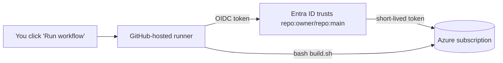

# Run it from GitHub (CI/CD) — a beginner's walkthrough

You've been unpacking a tarball on your Azure VM and running `bash build.sh` by
hand. This page turns that into a **one-click deploy from GitHub**: you press
**Run workflow**, GitHub spins up a clean machine, logs into Azure securely, and
runs the exact same scripts for you. No tarball, no VM babysitting.

New to CI/CD? Here's the whole idea in one line: **CI** (Continuous Integration)
automatically checks your code on every push; **CD** (Continuous Deployment) runs
your deploy on demand. Both are just scripts GitHub runs for you, defined in
`.github/workflows/*.yml`.

---

## What's in the box

| File | Trigger | What it does | Cost |
|------|---------|--------------|------|
| `.github/workflows/ci.yml` | every push / PR | lint + validate (shell, Python, JS, data). No Azure. | free |
| `.github/workflows/deploy.yml` | **manual** button | logs into Azure (OIDC) → `bash build.sh --type=ptu\|payg` | **billable** |
| `.github/workflows/wipe.yml` | **manual** button | logs into Azure (OIDC) → `bash wipe.sh [--delete-rg]` | stops billing |
| `scripts/setup-github-oidc.sh` | run once | wires Azure↔GitHub trust + sets repo secrets | free |

Deploys are **manual only** — nothing bills automatically when you push.

### How the runner reaches Azure (OIDC — no passwords)

The deploy runs on a GitHub-hosted Ubuntu machine that has `az` built in. It logs
in with **OpenID Connect**: GitHub proves "I am this repo's `main` branch", Azure
checks a trust you set up once, and hands back a short-lived token. **No secret or
password is ever stored.** Because the images build server-side with `az acr
build`, the runner needs **no Docker and no VM** — the whole stack builds from
GitHub.



---

## Step 1 — Install the tools (once, on your laptop)

- **[VS Code](https://code.visualstudio.com/)** — the editor.
- **[Git](https://git-scm.com/downloads)** — version control.
- **[GitHub CLI (`gh`)](https://cli.github.com/)** — easiest way to authenticate.
- VS Code extensions (Extensions panel, `Ctrl+Shift+X`): **GitHub Pull Requests**,
  **GitHub Actions**, and optionally **Azure Account**.

Sign in once:

```bash
gh auth login          # choose GitHub.com → HTTPS → login with browser
git config --global user.name  "Your Name"
git config --global user.email "you@example.com"
```

---

## Step 2 — Get the code into VS Code

If the repo already exists on GitHub, just clone it:

```bash
gh repo clone hrshl-demo/contoso-retail-acs-rm-assist-videocall
code contoso-retail-acs-rm-assist-videocall
```

VS Code basics you'll actually use:
- **Source Control** panel (`Ctrl+Shift+G`): stage → write a message → **Commit** → **Sync/Push**.
- **Terminal** (`` Ctrl+` ``): run `gh`, `git`, `az` commands.
- Edit a file, and the changed lines show up in Source Control to commit.

The normal loop:

```bash
git pull                       # get latest
# ...edit files...
git add -A
git commit -m "describe the change"
git push                       # this triggers CI automatically
```

---

## Step 3 — Wire GitHub → Azure (once)

From the repo root, logged into both `az` (as subscription **Owner**) and `gh`:

```bash
bash scripts/setup-github-oidc.sh
```

It creates an Entra app + GitHub federated credential, grants it **Owner** on your
subscription (build.sh both creates resources *and* assigns roles, so it needs
Owner or Contributor+User Access Administrator), and sets the three required repo
secrets:

| Secret | Meaning |
|--------|---------|
| `AZURE_CLIENT_ID` | the OIDC app's client id |
| `AZURE_TENANT_ID` | your tenant |
| `AZURE_SUBSCRIPTION_ID` | the target subscription |

Verify in **GitHub → repo → Settings → Secrets and variables → Actions**.

---

## Step 4 — (Optional) enable the calendared Teams flow

The "real Teams meeting on the RM's calendar" flow needs a **one-time admin
consent** that a GitHub runner cannot perform. Do it once from your VM/Cloud Shell
with a Global Admin activated — full steps in
**[ENTRA_PIM_ADMIN.md](ENTRA_PIM_ADMIN.md)** — then push the results as secrets:

```bash
gh secret set GRAPH_TENANT_ID     -R hrshl-demo/contoso-retail-acs-rm-assist-videocall -b "<tenant-id>"
gh secret set GRAPH_CLIENT_ID     -R hrshl-demo/contoso-retail-acs-rm-assist-videocall -b "<client-id>"
gh secret set GRAPH_CLIENT_SECRET -R hrshl-demo/contoso-retail-acs-rm-assist-videocall -b "<client-secret>"
gh secret set RM_USER_ID          -R hrshl-demo/contoso-retail-acs-rm-assist-videocall -b "<rm-object-id>"
```

For Teams nudges, also set `TEAMS_WEBHOOK_URL` (see
**[POWER_AUTOMATE.md](POWER_AUTOMATE.md)**). All of these are optional — the
deploy workflow only writes the ones you provide into `infra/common/secrets.env`.

---

## Step 5 — Deploy and wipe from the browser

1. GitHub → **Actions** tab.
2. **Deploy to Azure** → **Run workflow** → pick `ptu` or `payg` → **Run**.
3. Watch the live log. On success it prints the CRM + Video Assist URLs.
4. When you're done: **Wipe Azure** → **Run workflow** → `keep-rg` (fast, keeps the
   platform for the next demo) or `delete-rg` (delete everything).

You can also trigger from the terminal:

```bash
gh workflow run "Deploy to Azure" -f deploy_type=ptu
gh workflow run "Wipe Azure"      -f scope=delete-rg
gh run watch                      # follow the latest run
```

---

## Alternative: keep using your VM (self-hosted runner)

Prefer running on the VM you already have set up (with its `az` login, quota,
region proximity)? Register it as a **self-hosted runner** and the same workflows
run there instead:

1. GitHub → repo → **Settings → Actions → Runners → New self-hosted runner** →
   choose **Linux** and follow the copy-paste `./config.sh` + `./run.sh` steps.
2. Install it as a service so it survives reboots:
   ```bash
   sudo ./svc.sh install && sudo ./svc.sh start
   ```
3. In `deploy.yml` / `wipe.yml`, change `runs-on: ubuntu-latest` to
   `runs-on: [self-hosted, linux]` and (optionally) drop the `azure/login` step —
   the runner uses the VM's existing `az` context. For non-expiring auth, give the
   VM a **managed identity** with Owner and add `az login --identity` as the first
   step.

Trade-offs: the GitHub-hosted + OIDC path (default) needs **no** VM and no
maintenance; the self-hosted path reuses your exact working environment but you
own patching and uptime of the runner.

---

## Troubleshooting

| Symptom | Fix |
|---------|-----|
| `AADSTS700213` / no matching federated credential | The branch in the OIDC subject must match. `setup-github-oidc.sh` trusts `main`; run on `main` or re-run with `BRANCH=<yours>`. |
| `AuthorizationFailed` creating resources/roles | The OIDC app needs **Owner** (or Contributor + User Access Administrator). Re-run the setup script. |
| Deploy fails `Foundation is incomplete` | It shouldn't — v2.3.2 self-heals. If you set `AUTO_FOUNDATION=0`, run `build_rg.sh` first. |
| Calendared meeting is a "DEMO" link | `GRAPH_*` + `RM_USER_ID` secrets aren't set, or consent wasn't granted — see [ENTRA_PIM_ADMIN.md](ENTRA_PIM_ADMIN.md). |
| Nudges don't appear in Teams | `TEAMS_WEBHOOK_URL` secret not set or flow disabled — see [POWER_AUTOMATE.md](POWER_AUTOMATE.md). |
| Quota error on the chat deployment | Use `--type=payg` (GlobalStandard) or request PTU quota; both are torn down by wipe. |
| Wipe leaves the Entra app | The runner can't delete directory objects (`WIPE_GRAPH_APP=0`). Delete it from an admin machine — command in [ENTRA_PIM_ADMIN.md](ENTRA_PIM_ADMIN.md). |
